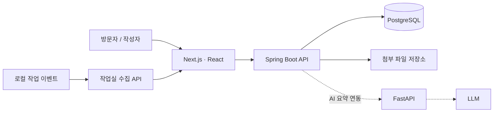

# Portfolio & Blog — gwangwon.dev

**[실제 서비스: https://gwangwon.dev](https://gwangwon.dev)** · **Production / Deployed**

조광원의 AI Backend / Backend Developer 포트폴리오와 기술 기록을 운영하는 웹 서비스입니다.
프로젝트의 담당 범위와 구현 근거를 소개하고, 글 작성·공개 범위·이미지 첨부·동시 편집 충돌을 백엔드와 연결합니다.

## 문제와 내가 한 일

포트폴리오의 소개 문구와 실제 구현 근거가 분리되지 않도록 프로젝트 설명·논문·공개 코드를 한곳에서 탐색하게 만들었습니다.
기술 기록에는 공개/비공개 접근 제어와 저장 충돌 처리가 필요했고, 이를 직접 운영하는 서비스 안에서 구현했습니다.

## 현재 기능

| 구현 | 판단과 근거 |
| --- | --- |
| 포트폴리오 정보 구조 | 직무·경력 근거 → Selected Work → Publication 순으로 구성하고 구현과 설계 상태를 분리했습니다. [콘텐츠 근거](docs/content/portfolio-positioning-2026-09-29.md) |
| 글 작성·조회·공개 범위 | 공개 읽기와 소유자 쓰기를 분리하고 비공개 글 접근을 API에서 제한합니다. [API 명세](docs/api/API_SPECIFICATION.md) |
| 이미지 첨부 | 글 공개 범위에 맞춰 첨부 조회 권한을 적용하고 DB와 첨부를 함께 백업합니다. [구현·검증](docs/review/image-attachments-2026-09-15.md) |
| 편집 충돌 처리 | 버전이 다른 저장 요청은 충돌로 알리고 최신 글과 복구본을 확인하게 합니다. [두 탭 검증](docs/review/blog-edit-conflicts-2026-09-16.md) |
| 작업실 화면 | 로컬 작업 이벤트를 수집해 AI 도구를 활용하는 개발 활동을 보여줍니다. [수집 구조](docs/guides/OFFICE_PRESENCE.md) |
| 운영 | Docker 기반 실행, 외부 HTTPS 연결, DB·첨부 백업과 배포 후 공개 경로 확인을 수행합니다. [배포 가이드](docs/guides/DEPLOYMENT_GUIDE.md) |

## Architecture · 기술 선택



- **Next.js / React / TypeScript**: 포트폴리오·기록·작업실 화면을 같은 웹 앱에서 구성합니다.
- **Spring Boot / PostgreSQL**: 인증, 글 접근 권한과 편집 버전을 API·DB에서 처리합니다. 백엔드는 역할별 Gradle 모듈로 분리했습니다.
- **FastAPI**: AI 요약 연동 코드를 별도 서비스로 둡니다. 영속적인 AI 실행 이력·분석 기능은 아직 설계 단계입니다.
- **Docker Compose**: 서비스 실행 설정과 영속 저장소를 관리합니다. 선택·실험용 서비스는 현재 운영 기능과 구분합니다.

## 실행

프런트엔드 화면 개발에는 Node.js 20과 npm이 필요합니다.

```bash
cd frontend
npm ci
npm run dev
```

글·인증 등 API 기능은 백엔드와 DB 설정이 필요합니다. Java 17, PostgreSQL, 환경 변수 및 전체 서비스 실행 절차는
[개발 가이드](docs/guides/DEVELOPMENT_GUIDE.md)와 [배포 가이드](docs/guides/DEPLOYMENT_GUIDE.md)를 따릅니다.
환경 변수 이름은 [.env.example](.env.example)에 있으며 실제 값은 커밋하지 않습니다.

## 테스트와 운영 근거

- [GitHub Actions CI](.github/workflows/ci.yml): 백엔드 Gradle check, 프런트엔드 lint·build·test, 문서 교차 참조 검증. [실행 결과](https://github.com/jokwangwon/portfolio-blog/actions/workflows/ci.yml)
- 프런트엔드: `cd frontend && npm ci && npm test`
- 백엔드: `cd backend && ./gradlew check` — 통합 테스트에는 Docker/Testcontainers 환경이 필요합니다.
- 배포는 운영 절차에 따라 수행합니다. **CI 통과와 운영 배포는 별개**이며 자동 CD가 구현됐다고 주장하지 않습니다.
- [백업 스크립트](scripts/backup-portal.sh), [이미지 첨부 검증](docs/review/image-attachments-2026-09-15.md), [편집 충돌 검증](docs/review/blog-edit-conflicts-2026-09-16.md)에서 백업·복구와 실제 API 검증 근거를 확인할 수 있습니다.
- 인증·권한·입력 검증은 구현되어 있지만 보안 인증이나 외부 보안 심사를 받은 서비스라는 의미는 아닙니다.

## 현재 상태와 한계

**Production / Deployed** — 포트폴리오·기록·작업실을 공개 운영합니다. 2026-09-29 포트폴리오 메시지 개편 화면을 반영했습니다.

글 수정 이력·복원과 영속 AI 분석은 설계 단계입니다. 과거 설계 문서의 벤치마크·확장 서비스는 공개 운영 기능과 구분해야 합니다.
운영 규모·사용자 수·성능 개선 수치는 추정하지 않습니다.

## AI-assisted development

AI agent를 코드 생성·반복 작업에 활용합니다. 요구사항 정의, 설계 판단, 코드 리뷰와 테스트·배포 검증은 개발자의 책임으로 두고
검증 결과를 [세션 기록](docs/sessions/README.md)과 리뷰 문서에 남깁니다.

[문서 인덱스](docs/INDEX.md) · [현재 개발 상태](docs/CONTEXT.md) · [개발자 프로필](https://github.com/jokwangwon)
