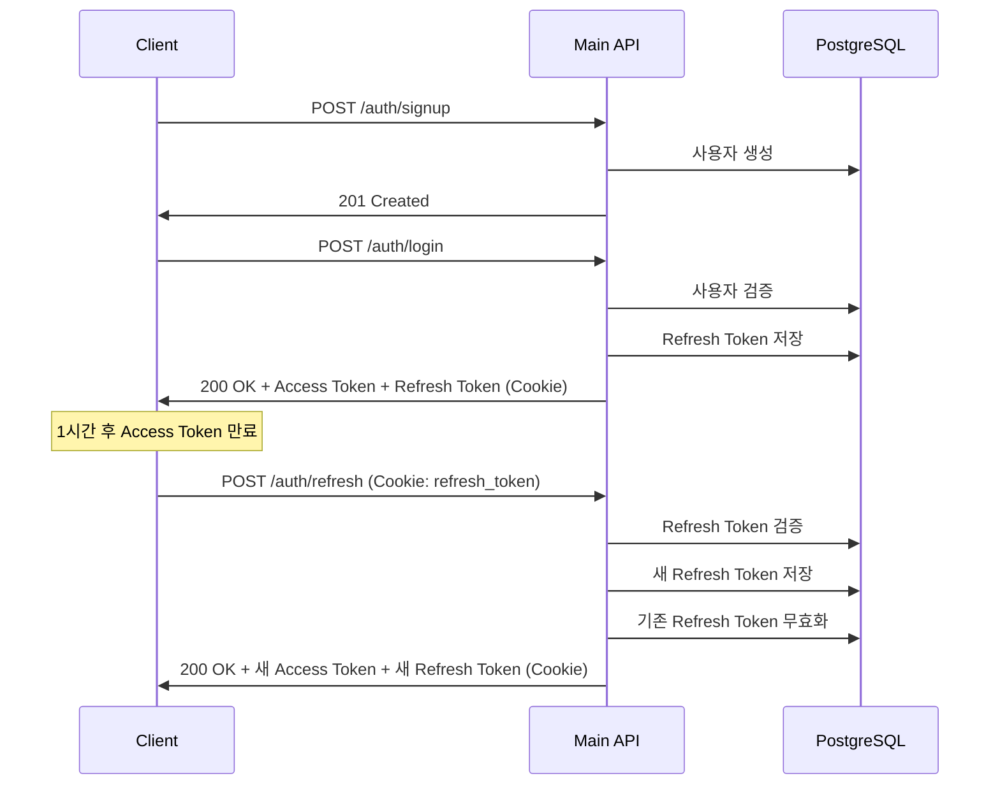

# API 명세서 (API Specification)

> **REST API 설계 문서**
> OpenAPI 3.0 기반 Frontend-Backend 계약

**작성일**: 2026-01-07
**우선순위**: 🔴 **CRITICAL**
**OpenAPI 파일**: `openapi.yaml`

---

## 1. 개요

### 1.1 API 버전
- **현재 버전**: v1
- **Base URL**: `http://localhost:8080/api/v1` (개발)
- **Content-Type**: `application/json`
- **Character Encoding**: UTF-8

### 1.2 인증 방식
- **JWT (JSON Web Token)** 기반 인증
- **Refresh Token Rotation** 패턴
- **OAuth2** 소셜 로그인 (Google, GitHub, Kakao)

---

## 2. 인증 (Authentication)

### 2.1 인증 흐름



### 2.2 API 엔드포인트

#### POST /auth/signup (회원가입)

**Request**:
```json
{
  "email": "user@example.com",
  "username": "johndoe",
  "password": "SecureP@ss123"
}
```

**Response** (201 Created):
```json
{
  "id": 1,
  "email": "user@example.com",
  "username": "johndoe",
  "role": "USER",
  "createdAt": "2026-01-07T10:00:00Z"
}
```

**검증 규칙**:
- `email`: RFC 5322 형식, 중복 불가
- `username`: 3~20자, 영문/숫자/언더스코어만, 중복 불가
- `password`: 8자 이상, 영문/숫자/특수문자 포함 권장

---

#### POST /auth/login (로그인)

**Request**:
```json
{
  "email": "user@example.com",
  "password": "SecureP@ss123"
}
```

**Response** (200 OK):
```json
{
  "accessToken": "eyJhbGciOiJIUzI1NiIsInR5cCI6IkpXVCJ9...",
  "username": "johndoe",
  "role": "USER"
}
```

**Headers**:
```
Set-Cookie: refresh_token=abc123...; HttpOnly; Secure; SameSite=Strict; Max-Age=604800; Path=/api/v1/auth/refresh
```

**Access Token Payload**:
```json
{
  "sub": "1",
  "username": "johndoe",
  "role": "USER",
  "iat": 1704614400,
  "exp": 1704618000
}
```

---

#### POST /auth/refresh (토큰 갱신)

**Request**:
- Cookie: `refresh_token=abc123...`

**Response** (200 OK):
```json
{
  "accessToken": "eyJhbGciOiJIUzI1NiIsInR5cCI6IkpXVCJ9..."
}
```

**Headers**:
```
Set-Cookie: refresh_token=xyz789...; HttpOnly; Secure; SameSite=Strict; Max-Age=604800; Path=/api/v1/auth/refresh
```

**에러** (401 Unauthorized):
```json
{
  "timestamp": "2026-01-07T10:30:00Z",
  "status": 401,
  "error": "Unauthorized",
  "message": "Refresh token expired or reused",
  "errorCode": "TOKEN_EXPIRED"
}
```

---

#### POST /auth/logout (로그아웃)

**Request**:
```
Authorization: Bearer {accessToken}
Cookie: refresh_token=abc123...
```

**Response** (204 No Content)

**Headers**:
```
Set-Cookie: refresh_token=; HttpOnly; Secure; SameSite=Strict; Max-Age=0; Path=/api/v1/auth/refresh
```

---

## 3. 게시글 (Posts)

### 3.1 게시글 목록 조회

#### GET /posts

**Query Parameters**:
- `page`: 페이지 번호 (0부터 시작, default: 0)
- `size`: 페이지 크기 (1~100, default: 20)
- `categoryId`: 카테고리 필터 (선택)
- `tagId`: 태그 필터 (선택)
- `status`: 상태 필터 (DRAFT, PUBLISHED, ARCHIVED)
- `sort`: 정렬 기준 (createdAt,desc | viewCount,desc | likeCount,desc)

**Request**:
```
GET /api/v1/posts?page=0&size=20&categoryId=1&sort=createdAt,desc
```

**Response** (200 OK):
```json
{
  "content": [
    {
      "id": 1,
      "title": "My First Blog Post",
      "slug": "my-first-blog-post",
      "excerpt": "This is a short summary...",
      "author": {
        "id": 1,
        "username": "johndoe"
      },
      "category": {
        "id": 1,
        "name": "Technology",
        "slug": "technology"
      },
      "tags": [
        { "id": 1, "name": "React", "slug": "react" },
        { "id": 2, "name": "TypeScript", "slug": "typescript" }
      ],
      "status": "PUBLISHED",
      "viewCount": 150,
      "likeCount": 25,
      "createdAt": "2026-01-05T10:00:00Z",
      "updatedAt": "2026-01-06T14:30:00Z"
    }
  ],
  "page": 0,
  "size": 20,
  "totalElements": 150,
  "totalPages": 8
}
```

---

### 3.2 게시글 상세 조회

#### GET /posts/{id}

**Request**:
```
GET /api/v1/posts/1
```

**Response** (200 OK):
```json
{
  "id": 1,
  "title": "My First Blog Post",
  "slug": "my-first-blog-post",
  "content": "# Introduction\n\nThis is my first post...",
  "excerpt": "This is a short summary...",
  "author": {
    "id": 1,
    "username": "johndoe"
  },
  "category": {
    "id": 1,
    "name": "Technology",
    "slug": "technology",
    "description": "Tech-related articles"
  },
  "tags": [
    { "id": 1, "name": "React", "slug": "react" }
  ],
  "status": "PUBLISHED",
  "viewCount": 151,
  "likeCount": 25,
  "createdAt": "2026-01-05T10:00:00Z",
  "updatedAt": "2026-01-06T14:30:00Z",
  "publishedAt": "2026-01-05T12:00:00Z"
}
```

**에러** (404 Not Found):
```json
{
  "timestamp": "2026-01-07T10:30:00Z",
  "status": 404,
  "error": "Not Found",
  "message": "Post not found with id: 999",
  "errorCode": "POST_NOT_FOUND"
}
```

---

### 3.3 게시글 작성

#### POST /posts

**Request**:
```
Authorization: Bearer {accessToken}
Content-Type: application/json

{
  "title": "My First Blog Post",
  "content": "# Introduction\n\nThis is my first post...",
  "excerpt": "This is a short summary...",
  "categoryId": 1,
  "tagIds": [1, 2, 3],
  "status": "DRAFT"
}
```

**Response** (201 Created):
```json
{
  "id": 1,
  "title": "My First Blog Post",
  "slug": "my-first-blog-post",
  "content": "# Introduction\n\nThis is my first post...",
  "excerpt": "This is a short summary...",
  "author": {
    "id": 1,
    "username": "johndoe"
  },
  "category": {
    "id": 1,
    "name": "Technology",
    "slug": "technology"
  },
  "tags": [
    { "id": 1, "name": "React", "slug": "react" }
  ],
  "status": "DRAFT",
  "viewCount": 0,
  "likeCount": 0,
  "createdAt": "2026-01-07T10:30:00Z",
  "updatedAt": "2026-01-07T10:30:00Z"
}
```

**검증 규칙**:
- `title`: 1~255자 필수
- `content`: 1자 이상 필수 (Markdown 형식)
- `excerpt`: 200자 이하 (선택)
- `categoryId`: 존재하는 카테고리 ID (선택)
- `tagIds`: 존재하는 태그 ID 배열 (선택)
- `status`: DRAFT 또는 PUBLISHED (default: DRAFT)

**에러** (400 Bad Request):
```json
{
  "timestamp": "2026-01-07T10:30:00Z",
  "status": 400,
  "error": "Bad Request",
  "message": "Title is required",
  "errorCode": "VALIDATION_ERROR"
}
```

---

### 3.4 게시글 수정

#### PUT /posts/{id}

**Request**:
```
Authorization: Bearer {accessToken}
Content-Type: application/json

{
  "title": "Updated Title",
  "content": "Updated content...",
  "status": "PUBLISHED"
}
```

**Response** (200 OK):
```json
{
  "id": 1,
  "title": "Updated Title",
  "slug": "my-first-blog-post",
  "content": "Updated content...",
  // ...
  "updatedAt": "2026-01-07T11:00:00Z",
  "publishedAt": "2026-01-07T11:00:00Z"
}
```

**권한**:
- 작성자 본인 또는 ADMIN만 수정 가능

**에러** (403 Forbidden):
```json
{
  "timestamp": "2026-01-07T10:30:00Z",
  "status": 403,
  "error": "Forbidden",
  "message": "You don't have permission to update this post",
  "errorCode": "FORBIDDEN"
}
```

---

### 3.5 게시글 삭제

#### DELETE /posts/{id}

**Request**:
```
Authorization: Bearer {accessToken}
```

**Response** (204 No Content)

**권한**:
- 작성자 본인 또는 ADMIN만 삭제 가능

**동작**:
- Soft Delete (deleted_at 컬럼에 타임스탬프 기록)
- 연관된 댓글, 태그 관계는 CASCADE로 삭제

---

## 4. 카테고리 & 태그

### 4.1 카테고리 목록 조회

#### GET /categories

**Response** (200 OK):
```json
[
  {
    "id": 1,
    "name": "Technology",
    "slug": "technology",
    "description": "Tech-related articles"
  },
  {
    "id": 2,
    "name": "Lifestyle",
    "slug": "lifestyle",
    "description": "Life and culture"
  }
]
```

---

### 4.2 태그 목록 조회

#### GET /tags

**Response** (200 OK):
```json
[
  { "id": 1, "name": "React", "slug": "react" },
  { "id": 2, "name": "TypeScript", "slug": "typescript" },
  { "id": 3, "name": "Python", "slug": "python" }
]
```

---

## 5. 댓글 (Comments)

### 5.1 댓글 목록 조회

#### GET /posts/{postId}/comments

**Request**:
```
GET /api/v1/posts/1/comments
```

**Response** (200 OK):
```json
[
  {
    "id": 1,
    "content": "Great post!",
    "author": {
      "id": 2,
      "username": "janedoe"
    },
    "parentId": null,
    "replies": [
      {
        "id": 2,
        "content": "Thanks!",
        "author": {
          "id": 1,
          "username": "johndoe"
        },
        "parentId": 1,
        "replies": [],
        "createdAt": "2026-01-05T11:00:00Z",
        "updatedAt": "2026-01-05T11:00:00Z"
      }
    ],
    "createdAt": "2026-01-05T10:30:00Z",
    "updatedAt": "2026-01-05T10:30:00Z"
  }
]
```

---

### 5.2 댓글 작성

#### POST /posts/{postId}/comments

**Request**:
```
Authorization: Bearer {accessToken}
Content-Type: application/json

{
  "content": "Great post!",
  "parentId": null
}
```

**Response** (201 Created):
```json
{
  "id": 1,
  "content": "Great post!",
  "author": {
    "id": 2,
    "username": "janedoe"
  },
  "parentId": null,
  "replies": [],
  "createdAt": "2026-01-07T10:30:00Z",
  "updatedAt": "2026-01-07T10:30:00Z"
}
```

**검증 규칙**:
- `content`: 1~1000자 필수
- `parentId`: 존재하는 댓글 ID (답글인 경우)

---

## 6. 에러 응답 형식

### 6.1 표준 에러 응답

모든 에러는 다음 형식을 따릅니다:

```json
{
  "timestamp": "2026-01-07T10:30:00Z",
  "status": 400,
  "error": "Bad Request",
  "message": "Detailed error message",
  "errorCode": "VALIDATION_ERROR",
  "path": "/api/v1/posts"
}
```

### 6.2 HTTP 상태 코드

| 코드 | 의미 | 사용 예시 |
|------|------|-----------|
| 200 | OK | GET, PUT 성공 |
| 201 | Created | POST 성공 (리소스 생성) |
| 204 | No Content | DELETE 성공 |
| 400 | Bad Request | 유효성 검증 실패 |
| 401 | Unauthorized | JWT 토큰 없음/만료 |
| 403 | Forbidden | 권한 없음 |
| 404 | Not Found | 리소스 없음 |
| 409 | Conflict | 중복 (이메일, 사용자명) |
| 500 | Internal Server Error | 서버 오류 |

### 6.3 에러 코드 목록

| errorCode | 의미 |
|-----------|------|
| `VALIDATION_ERROR` | 유효성 검증 실패 |
| `UNAUTHORIZED` | 인증 필요 |
| `TOKEN_EXPIRED` | 토큰 만료 |
| `TOKEN_REUSED` | 토큰 재사용 감지 |
| `FORBIDDEN` | 권한 없음 |
| `POST_NOT_FOUND` | 게시글 없음 |
| `USER_NOT_FOUND` | 사용자 없음 |
| `CATEGORY_NOT_FOUND` | 카테고리 없음 |
| `COMMENT_NOT_FOUND` | 댓글 없음 |
| `DUPLICATE_EMAIL` | 이메일 중복 |
| `DUPLICATE_USERNAME` | 사용자명 중복 |

---

## 7. Swagger UI 사용

### 7.1 로컬 접속

```
http://localhost:8080/swagger-ui.html
```

### 7.2 인증 테스트

1. `/auth/login` 엔드포인트 실행
2. 응답에서 `accessToken` 복사
3. Swagger UI 우측 상단 "Authorize" 버튼 클릭
4. `Bearer {accessToken}` 입력
5. 인증 필요한 API 테스트 가능

---

## 8. Frontend 연동 가이드

### 8.1 Axios 설정

```typescript
// src/shared/api/client.ts
import axios from 'axios';

const apiClient = axios.create({
  baseURL: process.env.NEXT_PUBLIC_API_URL,
  timeout: 10000,
  withCredentials: true, // Refresh Token Cookie 전송
});

// Request Interceptor (Access Token 추가)
apiClient.interceptors.request.use((config) => {
  const token = localStorage.getItem('accessToken');
  if (token) {
    config.headers.Authorization = `Bearer ${token}`;
  }
  return config;
});

// Response Interceptor (401 처리)
apiClient.interceptors.response.use(
  (response) => response,
  async (error) => {
    if (error.response?.status === 401) {
      // Access Token 갱신 시도
      const refreshed = await refreshAccessToken();
      if (refreshed) {
        // 원래 요청 재시도
        return apiClient(error.config);
      }
    }
    return Promise.reject(error);
  }
);

export default apiClient;
```

---

## 9. 개발 체크리스트

### 9.1 Backend 구현 전
- [ ] OpenAPI 스펙 검토 완료
- [ ] DTO 클래스 생성 (Request, Response)
- [ ] Controller 메서드 시그니처 확인
- [ ] 에러 응답 형식 GlobalExceptionHandler 구현

### 9.2 Frontend 구현 전
- [ ] OpenAPI 스펙 검토 완료
- [ ] TypeScript 타입 정의 (openapi-typescript-codegen 또는 수동)
- [ ] API 클라이언트 설정 (Axios Interceptor)
- [ ] 에러 처리 로직 구현

### 9.3 통합 테스트
- [ ] Swagger UI에서 모든 엔드포인트 테스트
- [ ] Frontend-Backend 연동 테스트
- [ ] 에러 케이스 테스트 (401, 403, 404)
- [ ] JWT Refresh Token Rotation 동작 확인

---

**이 명세서는 Frontend-Backend 간 계약입니다.**
**변경 시 반드시 양측 팀(또는 개발자)에게 공지하세요.**
**OpenAPI 파일(`openapi.yaml`)과 항상 동기화하세요.**
