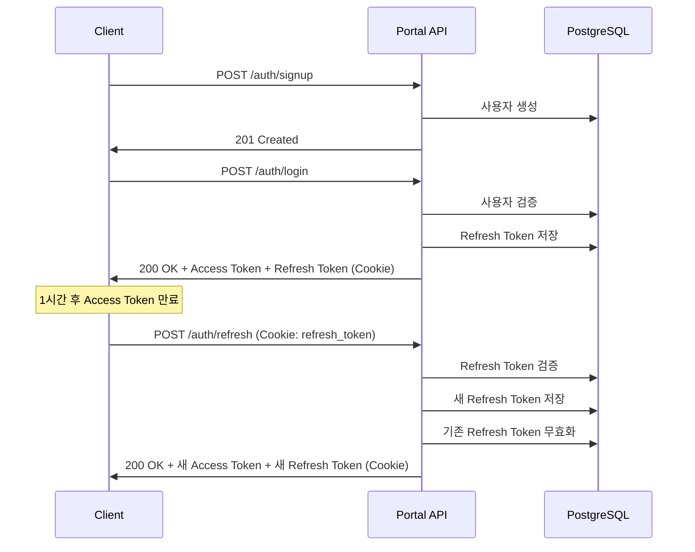

# API 명세서 (API Specification)

> **REST API 설계 문서**
> OpenAPI 3.0 기반 Frontend-Backend 계약

**작성일**: 2026-01-07
**최종 수정**: 2026-04-01
**우선순위**: 🔴 **CRITICAL**
**OpenAPI 파일**: `openapi.yaml`

---

## 1. 개요

### 1.1 API 버전
- **현재 버전**: v1
- **Base URL**: `http://localhost:8080/api/portal` (개발)
- **Content-Type**: `application/json`
- **Character Encoding**: UTF-8

### 1.2 인증 방식
- **JWT (JSON Web Token)** 기반 인증
- **Refresh Token Rotation** 패턴
- **OAuth2** 소셜 로그인 (Google, GitHub, Kakao)

---

## 2. 인증 (Authentication)

### 2.1 인증 흐름


```mermaid
sequenceDiagram
    participant C as Client
    participant API as Portal API
    participant DB as PostgreSQL

    C->>API: POST /auth/signup
    API->>DB: 사용자 생성
    API->>C: 201 Created

    C->>API: POST /auth/login
    API->>DB: 사용자 검증
    API->>DB: Refresh Token 저장
    API->>C: 200 OK + Access Token + Refresh Token (Cookie)

    Note over C: 1시간 후 Access Token 만료

    C->>API: POST /auth/refresh (Cookie: refresh_token)
    API->>DB: Refresh Token 검증
    API->>DB: 새 Refresh Token 저장
    API->>DB: 기존 Refresh Token 무효화
    API->>C: 200 OK + 새 Access Token + 새 Refresh Token (Cookie)
```

### 2.2 API 엔드포인트

#### POST /auth/signup (회원가입)

**Request**:
```json
{
  "email": "user@example.com",
  "username": "johndoe",
  "password": "SecureP@ss123"
}
```

**Response** (201 Created):
```json
{
  "id": 1,
  "email": "user@example.com",
  "username": "johndoe",
  "role": "USER",
  "createdAt": "2026-01-07T10:00:00Z"
}
```

**검증 규칙**:
- `email`: RFC 5322 형식, 중복 불가
- `username`: 3~20자, 영문/숫자/언더스코어만, 중복 불가, 정규식: `^[a-zA-Z0-9_]{3,20}$`
- `password`: 8자 이상, 영문+숫자 필수, 특수문자 선택, 정규식: `^(?=.*[a-zA-Z])(?=.*[0-9])[a-zA-Z0-9!@#$%^&*()_+\-=]{8,100}$`

**에러 응답**:
- 409 (`DUPLICATE_EMAIL`): 이메일 중복
- 409 (`DUPLICATE_USERNAME`): 사용자명 중복
- 400 (`VALIDATION_ERROR`): 필드별 검증 실패 (errors 배열 포함)

---

#### POST /auth/login (로그인)

**Request**:
```json
{
  "email": "user@example.com",
  "password": "SecureP@ss123"
}
```

**Response** (200 OK):
```json
{
  "accessToken": "eyJhbGciOiJIUzI1NiIsInR5cCI6IkpXVCJ9...",
  "username": "johndoe",
  "role": "USER"
}
```

**Headers**:
```
Set-Cookie: refresh_token=abc123...; HttpOnly; Secure; SameSite=Strict; Max-Age=604800; Path=/api/portal/auth/refresh
```

**Access Token Payload (JWT Claims)**:
```json
{
  "sub": "1",
  "username": "johndoe",
  "role": "USER",
  "iat": 1704614400,
  "exp": 1704618000,
  "iss": "portfolio-portal"
}
```

**JWT 상세 명세**:
- **서명 알고리즘**: HS256 (HMAC-SHA256)
- **서명 키**: 환경변수 `JWT_SECRET` (최소 256비트, Base64 인코딩)
- **Access Token 만료**: 15분 (`JWT_ACCESS_EXPIRATION=900000ms`)
- **Refresh Token 만료**: 7일 (`JWT_REFRESH_EXPIRATION=604800000ms`)
- **Claims 구조**:
  | Claim | Type | 설명 |
  |-------|------|------|
  | `sub` | String | 사용자 ID (bigint → string) |
  | `username` | String | 사용자명 |
  | `role` | String | 역할 (`USER` \| `ADMIN`) |
  | `iat` | Number | 발급 시각 (Unix timestamp) |
  | `exp` | Number | 만료 시각 (iat + 만료시간) |
  | `iss` | String | 발급자 (`portfolio-portal`) |

**Refresh Token Rotation 동작**:
1. 클라이언트가 Cookie의 `refresh_token`으로 `/auth/refresh` 호출
2. 서버: DB에서 토큰 조회 → `revoked=false` AND `expires_at > NOW()` 확인
3. **정상**: 기존 토큰 `revoked=true` 처리 → 같은 `token_family`로 새 토큰 발급
4. **재사용 감지**: 이미 `revoked=true`인 토큰 → 해당 `token_family` 전체 무효화 → 401 (`TOKEN_REUSED`)
5. **만료**: `expires_at < NOW()` → 401 (`TOKEN_EXPIRED`) → 재로그인 필요

**Access Token 저장 위치**: 클라이언트 메모리(JavaScript 변수). localStorage/sessionStorage 사용 금지 (XSS 방지). 새로고침 시 `/auth/refresh`로 재발급.

**로그아웃 동작**:
- 서버: 해당 사용자의 현재 `token_family` 전체 `revoked=true` 처리
- 클라이언트: 메모리의 Access Token 삭제, Cookie 만료(Max-Age=0)
- Access Token blacklist 미사용 (15분 만료로 충분, Phase 2에서 Redis blacklist 고려)

---

#### POST /auth/refresh (토큰 갱신)

**Request**:
- Cookie: `refresh_token=abc123...`

**Response** (200 OK):
```json
{
  "accessToken": "eyJhbGciOiJIUzI1NiIsInR5cCI6IkpXVCJ9..."
}
```

**Headers**:
```
Set-Cookie: refresh_token=xyz789...; HttpOnly; Secure; SameSite=Strict; Max-Age=604800; Path=/api/portal/auth/refresh
```

**에러** (401 Unauthorized):
```json
{
  "timestamp": "2026-01-07T10:30:00Z",
  "status": 401,
  "error": "Unauthorized",
  "message": "Refresh token expired or reused",
  "errorCode": "TOKEN_EXPIRED"
}
```

---

#### POST /auth/logout (로그아웃)

**Request**:
```
Authorization: Bearer {accessToken}
Cookie: refresh_token=abc123...
```

**Response** (204 No Content)

**Headers**:
```
Set-Cookie: refresh_token=; HttpOnly; Secure; SameSite=Strict; Max-Age=0; Path=/api/portal/auth/refresh
```

---

## 2A. 엔드포인트별 권한 매트릭스

> SecurityFilterChain 구현의 기준이 되는 문서

### 공개 경로 (인증 불필요)

| Method | Path | 설명 | 비고 |
|--------|------|------|------|
| POST | `/auth/signup` | 회원가입 | |
| POST | `/auth/login` | 로그인 | |
| POST | `/auth/refresh` | 토큰 갱신 | Cookie 필요 |
| GET | `/posts` | 게시글 목록 | PUBLISHED만 반환 |
| GET | `/posts/{id}` | 게시글 상세 | PUBLISHED만 반환 |
| GET | `/posts/{postId}/comments` | 댓글 목록 | |
| GET | `/categories` | 카테고리 목록 | |
| GET | `/tags` | 태그 목록 | |
| GET | `/posts/search` | 게시글 검색 | PUBLISHED만 |
| GET | `/health` | 헬스 체크 | Service Contract |
| GET | `/api/summary` | 서비스 요약 | Service Contract |

### 인증 필요 (로그인 사용자)

| Method | Path | 필요 역할 | 추가 조건 |
|--------|------|----------|-----------|
| POST | `/auth/logout` | USER+ | 본인 토큰만 |
| POST | `/posts` | USER+ | |
| PUT | `/posts/{id}` | USER+ | 작성자 본인 또는 ADMIN |
| DELETE | `/posts/{id}` | USER+ | 작성자 본인 또는 ADMIN |
| POST | `/posts/{postId}/comments` | USER+ | |
| PUT | `/posts/{postId}/comments/{id}` | USER+ | 작성자 본인 또는 ADMIN |
| DELETE | `/posts/{postId}/comments/{id}` | USER+ | 작성자 본인 또는 ADMIN |
| POST | `/posts/{id}/like` | USER+ | |
| DELETE | `/posts/{id}/like` | USER+ | |
| POST | `/ai/summarize` | USER+ | 블로그 글 요약 생성 |

### 관리자 전용 (ADMIN)

| Method | Path | 설명 |
|--------|------|------|
| POST | `/categories` | 카테고리 생성 |
| PUT | `/categories/{id}` | 카테고리 수정 |
| DELETE | `/categories/{id}` | 카테고리 삭제 |
| POST | `/tags` | 태그 생성 |
| PUT | `/tags/{id}` | 태그 수정 |
| DELETE | `/tags/{id}` | 태그 삭제 |

### 역할 정의

| Role | 설명 | 권한 |
|------|------|------|
| `USER` | 일반 사용자 | 글 작성, 댓글 작성, 좋아요, 본인 리소스 수정/삭제 |
| `ADMIN` | 관리자 | USER 권한 + 모든 리소스 수정/삭제 + 카테고리/태그 관리 |

> Phase 1에서는 USER, ADMIN 2개만 사용. MODERATOR 등은 Phase 2에서 필요 시 추가.

---

## 2B. SecurityFilterChain 설정 명세

```java
// 실제 SecurityConfig 구현 시 이 명세를 따를 것

http
  .csrf(csrf -> csrf.disable())  // Stateless JWT, CSRF 불필요
  .sessionManagement(session -> session.sessionCreationPolicy(STATELESS))
  .cors(cors -> cors.configurationSource(corsConfigurationSource()))
  .authorizeHttpRequests(auth -> auth
      // 공개 경로
      .requestMatchers(GET, "/health", "/api/summary").permitAll()
      .requestMatchers(POST, "/api/portal/auth/signup", "/api/portal/auth/login", "/api/portal/auth/refresh").permitAll()
      .requestMatchers(GET, "/api/portal/posts/**", "/api/portal/categories", "/api/portal/tags").permitAll()
      .requestMatchers(GET, "/api/portal/posts/search").permitAll()
      // Swagger
      .requestMatchers("/swagger-ui/**", "/v3/api-docs/**").permitAll()
      // 관리자 전용
      .requestMatchers(POST, "/api/portal/categories", "/api/portal/tags").hasRole("ADMIN")
      .requestMatchers(PUT, "/api/portal/categories/**", "/api/portal/tags/**").hasRole("ADMIN")
      .requestMatchers(DELETE, "/api/portal/categories/**", "/api/portal/tags/**").hasRole("ADMIN")
      // 나머지는 인증 필요
      .anyRequest().authenticated()
  )
  .addFilterBefore(jwtAuthenticationFilter, UsernamePasswordAuthenticationFilter.class);
```

### CORS 정책

```java
@Bean
CorsConfigurationSource corsConfigurationSource() {
    CorsConfiguration config = new CorsConfiguration();
    config.setAllowedOrigins(List.of(
        "http://localhost:3000",      // Frontend (dev)
        "https://yourdomain.com"      // Frontend (prod) — 배포 시 변경
    ));
    config.setAllowedMethods(List.of("GET", "POST", "PUT", "DELETE", "OPTIONS"));
    config.setAllowedHeaders(List.of("Authorization", "Content-Type", "X-Requested-With"));
    config.setExposedHeaders(List.of("Set-Cookie"));
    config.setAllowCredentials(true);  // Cookie 전송 허용 (Refresh Token)
    config.setMaxAge(3600L);           // Preflight 캐시 1시간

    UrlBasedCorsConfigurationSource source = new UrlBasedCorsConfigurationSource();
    source.registerCorsConfiguration("/api/**", config);
    return source;
}
```

### Refresh Token Cookie 설정

| 속성 | 값 | 이유 |
|------|-----|------|
| HttpOnly | `true` | JavaScript 접근 차단 (XSS 방지) |
| Secure | `true` (prod), `false` (dev) | HTTPS에서만 전송 |
| SameSite | `Strict` | CSRF 방지 |
| Path | `/api/portal/auth/refresh` | refresh 엔드포인트에서만 전송 |
| Max-Age | `604800` (7일) | Refresh Token 만료와 동일 |
| Domain | 미설정 (현재 도메인) | 서브도메인 공유 불필요 |

---

## 3. 게시글 (Posts)

### 3.0 게시글 비즈니스 규칙

**상태 전이**:
```
DRAFT → PUBLISHED   (publishedAt = NOW() 자동 설정, 최초 발행 시)
PUBLISHED → DRAFT   (publishedAt 유지, 비공개 전환)
PUBLISHED → ARCHIVED (publishedAt 유지, 보관 처리)
DRAFT → ARCHIVED    (publishedAt = null 유지)
ARCHIVED → DRAFT    (재활성화)
```

**접근 권한 규칙**:
- **비인증 사용자**: PUBLISHED 상태의 글만 조회 가능
- **작성자 본인**: 본인의 DRAFT/PUBLISHED/ARCHIVED 모두 조회 가능
- **ADMIN**: 모든 상태의 글 조회 가능
- **DRAFT 글 직접 접근 시**: 비인증/타인 → 404 (존재 자체를 숨김)

**Slug 생성 규칙**:
- `title`에서 자동 생성: 소문자 변환, 공백→하이픈, 특수문자 제거
- 예: "My First Blog Post" → `my-first-blog-post`
- **중복 시**: 타임스탬프 suffix 추가 (예: `my-first-blog-post-1704614400`)
- Slug는 수정 불가 (URL 영속성 보장)

**Excerpt 규칙**:
- 요청에 `excerpt`가 없으면: `content`의 처음 200자에서 마크다운 태그 제거 후 자동 생성
- 요청에 `excerpt`가 있으면: 그대로 사용 (최대 200자)

**viewCount 증가 규칙**:
- GET /posts/{id} 호출 시마다 +1 (단순 카운트)
- Phase 2에서 IP/세션 기반 중복 방지 고려

**다중 필터 결합**: `categoryId=1&tagId=2` → AND 조건 (카테고리 1 이면서 태그 2)

**size 초과 요청**: `size > 100` → 100으로 자동 조정 (에러 아님)

### 3.1 게시글 목록 조회

#### GET /posts

**Query Parameters**:
- `page`: 페이지 번호 (0부터 시작, default: 0)
- `size`: 페이지 크기 (1~100, default: 20, 초과 시 100으로 조정)
- `categoryId`: 카테고리 필터 (선택, AND 결합)
- `tagId`: 태그 필터 (선택, AND 결합)
- `status`: 상태 필터 — 비인증 시 무시(PUBLISHED 고정), 인증 시 본인 글 필터 가능
- `sort`: 정렬 기준 (createdAt,desc | createdAt,asc | viewCount,desc | likeCount,desc)

**Request**:
```
GET /api/portal/posts?page=0&size=20&categoryId=1&sort=createdAt,desc
```

**Response** (200 OK):
```json
{
  "content": [
    {
      "id": 1,
      "title": "My First Blog Post",
      "slug": "my-first-blog-post",
      "excerpt": "This is a short summary...",
      "author": {
        "id": 1,
        "username": "johndoe"
      },
      "category": {
        "id": 1,
        "name": "Technology",
        "slug": "technology"
      },
      "tags": [
        { "id": 1, "name": "React", "slug": "react" },
        { "id": 2, "name": "TypeScript", "slug": "typescript" }
      ],
      "status": "PUBLISHED",
      "viewCount": 150,
      "likeCount": 25,
      "createdAt": "2026-01-05T10:00:00Z",
      "updatedAt": "2026-01-06T14:30:00Z"
    }
  ],
  "page": 0,
  "size": 20,
  "totalElements": 150,
  "totalPages": 8
}
```

---

### 3.2 게시글 상세 조회

#### GET /posts/{id}

**Request**:
```
GET /api/portal/posts/1
```

**Response** (200 OK):
```json
{
  "id": 1,
  "title": "My First Blog Post",
  "slug": "my-first-blog-post",
  "content": "# Introduction\n\nThis is my first post...",
  "excerpt": "This is a short summary...",
  "author": {
    "id": 1,
    "username": "johndoe"
  },
  "category": {
    "id": 1,
    "name": "Technology",
    "slug": "technology",
    "description": "Tech-related articles"
  },
  "tags": [
    { "id": 1, "name": "React", "slug": "react" }
  ],
  "status": "PUBLISHED",
  "viewCount": 151,
  "likeCount": 25,
  "createdAt": "2026-01-05T10:00:00Z",
  "updatedAt": "2026-01-06T14:30:00Z",
  "publishedAt": "2026-01-05T12:00:00Z"
}
```

**에러** (404 Not Found):
```json
{
  "timestamp": "2026-01-07T10:30:00Z",
  "status": 404,
  "error": "Not Found",
  "message": "Post not found with id: 999",
  "errorCode": "POST_NOT_FOUND"
}
```

---

### 3.3 게시글 작성

#### POST /posts

**Request**:
```
Authorization: Bearer {accessToken}
Content-Type: application/json

{
  "title": "My First Blog Post",
  "content": "# Introduction\n\nThis is my first post...",
  "excerpt": "This is a short summary...",
  "categoryId": 1,
  "tagIds": [1, 2, 3],
  "status": "DRAFT"
}
```

**Response** (201 Created):
```json
{
  "id": 1,
  "title": "My First Blog Post",
  "slug": "my-first-blog-post",
  "content": "# Introduction\n\nThis is my first post...",
  "excerpt": "This is a short summary...",
  "author": {
    "id": 1,
    "username": "johndoe"
  },
  "category": {
    "id": 1,
    "name": "Technology",
    "slug": "technology"
  },
  "tags": [
    { "id": 1, "name": "React", "slug": "react" }
  ],
  "status": "DRAFT",
  "viewCount": 0,
  "likeCount": 0,
  "createdAt": "2026-01-07T10:30:00Z",
  "updatedAt": "2026-01-07T10:30:00Z"
}
```

**검증 규칙**:
- `title`: 1~255자 필수
- `content`: 1자 이상 필수 (Markdown 형식)
- `excerpt`: 200자 이하 (선택)
- `categoryId`: 존재하는 카테고리 ID (선택)
- `tagIds`: 존재하는 태그 ID 배열 (선택)
- `status`: DRAFT 또는 PUBLISHED (default: DRAFT)

**에러** (400 Bad Request):
```json
{
  "timestamp": "2026-01-07T10:30:00Z",
  "status": 400,
  "error": "Bad Request",
  "message": "Title is required",
  "errorCode": "VALIDATION_ERROR"
}
```

---

### 3.4 게시글 수정

#### PUT /posts/{id}

**Request**:
```
Authorization: Bearer {accessToken}
Content-Type: application/json

{
  "title": "Updated Title",
  "content": "Updated content...",
  "status": "PUBLISHED"
}
```

**Response** (200 OK):
```json
{
  "id": 1,
  "title": "Updated Title",
  "slug": "my-first-blog-post",
  "content": "Updated content...",
  // ...
  "updatedAt": "2026-01-07T11:00:00Z",
  "publishedAt": "2026-01-07T11:00:00Z"
}
```

**권한**:
- 작성자 본인 또는 ADMIN만 수정 가능

**에러** (403 Forbidden):
```json
{
  "timestamp": "2026-01-07T10:30:00Z",
  "status": 403,
  "error": "Forbidden",
  "message": "You don't have permission to update this post",
  "errorCode": "FORBIDDEN"
}
```

---

### 3.5 게시글 삭제

#### DELETE /posts/{id}

**Request**:
```
Authorization: Bearer {accessToken}
```

**Response** (204 No Content)

**권한**:
- 작성자 본인 또는 ADMIN만 삭제 가능

**동작**:
- Soft Delete (deleted_at 컬럼에 타임스탬프 기록)
- 이미 삭제된 게시글 재삭제 시: 404 반환
- Soft Delete된 게시글: 목록에 미표시, 상세 조회 시 404
- Hard Delete는 Phase 1에서 미지원 (ADMIN도 Soft Delete만)

---

### 3.6 게시글 검색

#### GET /posts/search

**Query Parameters**:
- `q`: 검색어 (필수, 2자 이상, title+content 대상)
- `page`, `size`, `sort`: 목록 조회와 동일

**Response**: GET /posts와 동일한 페이징 형식

**검색 방식**: PostgreSQL `ILIKE '%keyword%'` (Phase 1). Phase 2에서 Full-Text Search 전환 고려.

---

### 3.7 좋아요

#### POST /posts/{id}/like (좋아요 추가)

**Request**: `Authorization: Bearer {accessToken}`

**Response** (200 OK):
```json
{
  "postId": 1,
  "likeCount": 26,
  "liked": true
}
```

**동작**: 사용자당 게시글 1회만 좋아요 가능. 이미 좋아요한 경우 409 (`ALREADY_LIKED`)

#### DELETE /posts/{id}/like (좋아요 취소)

**Request**: `Authorization: Bearer {accessToken}`

**Response** (200 OK):
```json
{
  "postId": 1,
  "likeCount": 25,
  "liked": false
}
```

> 참고: likes 테이블 필요 (user_id, post_id, created_at). DB 스키마에 추가 필요.

---

## 4. 카테고리 & 태그

### 4.1 카테고리 목록 조회

#### GET /categories

**Response** (200 OK):
```json
[
  {
    "id": 1,
    "name": "Technology",
    "slug": "technology",
    "description": "Tech-related articles"
  },
  {
    "id": 2,
    "name": "Lifestyle",
    "slug": "lifestyle",
    "description": "Life and culture"
  }
]
```

**정렬**: 이름 오름차순 (name ASC). 전체 반환 (페이징 없음 — 카테고리 수 제한적).

---

### 4.2 태그 목록 조회

#### GET /tags

**Response** (200 OK):
```json
[
  { "id": 1, "name": "React", "slug": "react" },
  { "id": 2, "name": "TypeScript", "slug": "typescript" },
  { "id": 3, "name": "Python", "slug": "python" }
]
```

**정렬**: 이름 오름차순 (name ASC). 전체 반환 (페이징 없음).

---

### 4.3 카테고리 생성 (ADMIN)

#### POST /categories

**Request**:
```
Authorization: Bearer {accessToken}
Content-Type: application/json

{
  "name": "DevOps",
  "slug": "devops",
  "description": "CI/CD, Infrastructure 관련 글"
}
```

**검증 규칙**:
- `name`: 1~100자 필수, 중복 불가
- `slug`: 1~100자 필수, 영문소문자/숫자/하이픈만 (`^[a-z0-9-]{1,100}$`), 중복 불가
- `description`: 500자 이하 (선택)

**Response** (201 Created): Category 객체

---

### 4.4 카테고리 수정/삭제 (ADMIN)

#### PUT /categories/{id}
- Request: name, slug, description (부분 수정 가능)
- Response (200 OK): 수정된 Category 객체

#### DELETE /categories/{id}
- Response (204 No Content)
- 동작: 해당 카테고리의 게시글은 `category_id = NULL`로 변경 (SET NULL)

### 4.5 태그 생성/수정/삭제 (ADMIN)

#### POST /tags
- Request: `{ "name": "Docker", "slug": "docker" }`
- 검증: `name` 1~50자, `slug` 1~50자 (`^[a-z0-9-]{1,50}$`), 각각 중복 불가
- Response (201 Created): Tag 객체

#### PUT /tags/{id}
- Response (200 OK): 수정된 Tag 객체

#### DELETE /tags/{id}
- Response (204 No Content)
- 동작: post_tags 관계 CASCADE 삭제

---

## 5. 댓글 (Comments)

### 5.1 댓글 목록 조회

#### GET /posts/{postId}/comments

**Request**:
```
GET /api/portal/posts/1/comments
```

**Response** (200 OK):
```json
[
  {
    "id": 1,
    "content": "Great post!",
    "author": {
      "id": 2,
      "username": "janedoe"
    },
    "parentId": null,
    "replies": [
      {
        "id": 2,
        "content": "Thanks!",
        "author": {
          "id": 1,
          "username": "johndoe"
        },
        "parentId": 1,
        "replies": [],
        "createdAt": "2026-01-05T11:00:00Z",
        "updatedAt": "2026-01-05T11:00:00Z"
      }
    ],
    "createdAt": "2026-01-05T10:30:00Z",
    "updatedAt": "2026-01-05T10:30:00Z"
  }
]
```

---

### 5.2 댓글 작성

#### POST /posts/{postId}/comments

**Request**:
```
Authorization: Bearer {accessToken}
Content-Type: application/json

{
  "content": "Great post!",
  "parentId": null
}
```

**Response** (201 Created):
```json
{
  "id": 1,
  "content": "Great post!",
  "author": {
    "id": 2,
    "username": "janedoe"
  },
  "parentId": null,
  "replies": [],
  "createdAt": "2026-01-07T10:30:00Z",
  "updatedAt": "2026-01-07T10:30:00Z"
}
```

**검증 규칙**:
- `content`: 1~1000자 필수
- `parentId`: 존재하는 댓글 ID (답글인 경우). 존재하지 않으면 400 (`COMMENT_NOT_FOUND`)

**댓글 비즈니스 규칙**:
- 계층 깊이 제한: 최대 2단계 (댓글 → 답글). 답글에 답글 불가 (parentId가 이미 답글이면 400)
- Soft Delete된 댓글: 목록에서 `"[삭제된 댓글입니다]"`로 표시 (replies는 유지)
- 정렬: 생성 시간 오름차순 (created_at ASC)
- 페이징 없음 (게시글당 댓글 수 제한적). Phase 2에서 커서 기반 페이징 고려.

---

### 5.3 댓글 수정

#### PUT /posts/{postId}/comments/{id}

**Request**:
```
Authorization: Bearer {accessToken}
Content-Type: application/json

{
  "content": "수정된 댓글 내용"
}
```

**Response** (200 OK): Comment 객체

**권한**: 작성자 본인 또는 ADMIN

---

### 5.4 댓글 삭제

#### DELETE /posts/{postId}/comments/{id}

**Request**: `Authorization: Bearer {accessToken}`

**Response** (204 No Content)

**권한**: 작성자 본인 또는 ADMIN

**동작**: Soft Delete (deleted_at 타임스탬프 기록). 하위 답글은 유지.

---

## 6. 에러 응답 형식

### 6.1 표준 에러 응답

모든 에러는 다음 형식을 따릅니다:

```json
{
  "timestamp": "2026-01-07T10:30:00Z",
  "status": 400,
  "error": "Bad Request",
  "message": "Detailed error message",
  "errorCode": "VALIDATION_ERROR",
  "path": "/api/portal/posts"
}
```

### 6.2 HTTP 상태 코드

| 코드 | 의미 | 사용 예시 |
|------|------|-----------|
| 200 | OK | GET, PUT 성공 |
| 201 | Created | POST 성공 (리소스 생성) |
| 204 | No Content | DELETE 성공 |
| 400 | Bad Request | 유효성 검증 실패 |
| 401 | Unauthorized | JWT 토큰 없음/만료 |
| 403 | Forbidden | 권한 없음 |
| 404 | Not Found | 리소스 없음 |
| 409 | Conflict | 중복 (이메일, 사용자명) |
| 500 | Internal Server Error | 서버 오류 |

### 6.3 Validation 실패 응답 (필드별 에러)

유효성 검증 실패 시 `errors` 배열로 필드별 상세 정보를 반환합니다:

```json
{
  "timestamp": "2026-01-07T10:30:00Z",
  "status": 400,
  "error": "Bad Request",
  "message": "Validation failed",
  "errorCode": "VALIDATION_ERROR",
  "path": "/api/portal/auth/signup",
  "errors": [
    { "field": "email", "message": "이메일 형식이 올바르지 않습니다" },
    { "field": "password", "message": "비밀번호는 8자 이상, 영문+숫자를 포함해야 합니다" }
  ]
}
```

단일 필드 에러인 경우에도 `errors` 배열을 사용합니다. `message`는 `"Validation failed"` 고정.

### 6.4 에러 코드 전체 목록

#### 인증 (AUTH)

| errorCode | HTTP | 발생 조건 |
|-----------|------|-----------|
| `VALIDATION_ERROR` | 400 | 필드 유효성 검증 실패 (errors 배열 포함) |
| `UNAUTHORIZED` | 401 | JWT 토큰 없음 또는 유효하지 않음 |
| `TOKEN_EXPIRED` | 401 | Access Token 또는 Refresh Token 만료 |
| `TOKEN_REUSED` | 401 | Refresh Token 재사용 감지 → token_family 전체 무효화 |
| `INVALID_CREDENTIALS` | 401 | 이메일 또는 비밀번호 불일치 |
| `FORBIDDEN` | 403 | 인증됨. 해당 리소스에 대한 권한 없음 |
| `DUPLICATE_EMAIL` | 409 | 이미 사용 중인 이메일 |
| `DUPLICATE_USERNAME` | 409 | 이미 사용 중인 사용자명 |

#### 게시글 (POST)

| errorCode | HTTP | 발생 조건 |
|-----------|------|-----------|
| `POST_NOT_FOUND` | 404 | 게시글이 존재하지 않거나 삭제됨 |
| `POST_NOT_OWNER` | 403 | 작성자가 아닌 사용자의 수정/삭제 시도 |
| `ALREADY_LIKED` | 409 | 이미 좋아요한 게시글에 중복 좋아요 |
| `NOT_LIKED` | 409 | 좋아요하지 않은 게시글에 좋아요 취소 |

#### 카테고리/태그 (CATEGORY, TAG)

| errorCode | HTTP | 발생 조건 |
|-----------|------|-----------|
| `CATEGORY_NOT_FOUND` | 404 | 카테고리 없음 |
| `TAG_NOT_FOUND` | 404 | 태그 없음 |
| `DUPLICATE_CATEGORY` | 409 | 카테고리 이름/slug 중복 |
| `DUPLICATE_TAG` | 409 | 태그 이름/slug 중복 |

#### 댓글 (COMMENT)

| errorCode | HTTP | 발생 조건 |
|-----------|------|-----------|
| `COMMENT_NOT_FOUND` | 404 | 댓글 없음 |
| `COMMENT_NOT_OWNER` | 403 | 작성자가 아닌 사용자의 수정/삭제 |
| `COMMENT_DEPTH_EXCEEDED` | 400 | 답글의 답글 시도 (최대 2단계) |

#### 사용자 (USER)

| errorCode | HTTP | 발생 조건 |
|-----------|------|-----------|
| `USER_NOT_FOUND` | 404 | 사용자 없음 |

#### 시스템 (SYSTEM)

| errorCode | HTTP | 발생 조건 |
|-----------|------|-----------|
| `INTERNAL_ERROR` | 500 | 서버 내부 오류 (스택 트레이스 미노출) |
| `SERVICE_UNAVAILABLE` | 503 | 외부 서비스 연결 실패 |

---

## 6B. AI 기능 엔드포인트

### POST /ai/summarize (블로그 글 요약 생성)

**설명**: LLM(Gemini/Ollama)을 사용하여 블로그 글 본문을 자동 요약합니다.
Langfuse를 통한 LLM 호출 추적(Observability)을 지원합니다.

**인증**: Bearer Token 필수 (USER+)

**Request**:
```json
{
  "content": "블로그 글 본문 (필수, @NotBlank)",
  "title": "글 제목 (선택)",
  "maxLength": 200
}
```

| 필드 | 타입 | 필수 | 기본값 | 설명 |
|------|------|------|--------|------|
| content | String | O | - | 요약 대상 본문 텍스트 |
| title | String | X | null | 요약 품질 향상을 위한 글 제목 |
| maxLength | int | X | 200 | 최대 요약 글자 수 |

**Response** (200 OK):
```json
{
  "summary": "AI가 생성한 요약문",
  "provider": "gemini",
  "durationMs": 1523
}
```

**에러**:
| HTTP | errorCode | 설명 |
|------|-----------|------|
| 400 | VALIDATION_FAILED | content가 비어있을 때 |
| 401 | UNAUTHORIZED | 인증 토큰 없음/만료 |
| 503 | SERVICE_UNAVAILABLE | LLM 제공자 연결 실패 |

**기술 스택**:
- LangChain4j (`dev.langchain4j:langchain4j:0.36.2`)
- Google Gemini (`langchain4j-google-ai-gemini`) 또는 Ollama (`langchain4j-ollama`)
- Langfuse Java SDK (`io.langfuse:langfuse-java:0.0.7`) — LLM 호출 추적

**설정** (`application-dev.yml`):
```yaml
ai:
  provider: gemini          # gemini | ollama
  gemini-api-key: ${GEMINI_API_KEY}
  gemini-model: gemini-1.5-flash
  ollama-host: http://localhost:11434
  ollama-model: llama3

langfuse:
  public-key: ${LANGFUSE_PUBLIC_KEY:}
  secret-key: ${LANGFUSE_SECRET_KEY:}
  host: https://cloud.langfuse.com
```

---

## 6A. Service Contract 엔드포인트

> 모든 서비스(Portal API, AI Benchmark API, 향후 서비스)가 구현해야 하는 필수 엔드포인트

### GET /health (헬스 체크)

**인증**: 불필요

**Response** (200 OK):
```json
{
  "status": "UP",
  "service": "portal-api",
  "version": "1.0.0",
  "timestamp": "2026-03-30T10:00:00Z"
}
```

**status 값**: `UP` | `DOWN` | `DEGRADED`
- `UP`: 정상 (DB 연결 포함)
- `DOWN`: DB 연결 실패 등 핵심 기능 장애
- `DEGRADED`: 부분 장애 (핵심은 OK, 부가 기능 실패)

**에러 시에도 200 반환** (상태값으로 구분). 서비스 자체가 죽으면 타임아웃 처리.

### GET /api/summary (서비스 요약)

**인증**: 불필요

**Response** (200 OK):
```json
{
  "service": "portal-api",
  "displayName": "포트폴리오 포털",
  "description": "블로그, 인증, Service Registry 통합 관리",
  "icon": "globe",
  "stats": {
    "totalPosts": 42,
    "totalUsers": 5,
    "totalComments": 128,
    "lastUpdated": "2026-03-30T10:00:00Z"
  },
  "routes": [
    { "path": "/blog", "label": "블로그" },
    { "path": "/blog/categories", "label": "카테고리" }
  ]
}
```

**에러 시** (500):
```json
{
  "error": "SUMMARY_UNAVAILABLE",
  "message": "Failed to retrieve summary data",
  "timestamp": "2026-03-30T10:00:00Z"
}
```

---

## 7. Swagger UI 사용

### 7.1 로컬 접속

```
http://localhost:8080/swagger-ui.html
```

### 7.2 인증 테스트

1. `/auth/login` 엔드포인트 실행
2. 응답에서 `accessToken` 복사
3. Swagger UI 우측 상단 "Authorize" 버튼 클릭
4. `Bearer {accessToken}` 입력
5. 인증 필요한 API 테스트 가능

---

## 8. Frontend 연동 가이드

### 8.1 Axios 설정

```typescript
// src/shared/api/client.ts
import axios from 'axios';

const apiClient = axios.create({
  baseURL: process.env.NEXT_PUBLIC_API_URL,
  timeout: 10000,
  withCredentials: true, // Refresh Token Cookie 전송
});

// Request Interceptor (Access Token 추가)
apiClient.interceptors.request.use((config) => {
  const token = localStorage.getItem('accessToken');
  if (token) {
    config.headers.Authorization = `Bearer ${token}`;
  }
  return config;
});

// Response Interceptor (401 처리)
apiClient.interceptors.response.use(
  (response) => response,
  async (error) => {
    if (error.response?.status === 401) {
      // Access Token 갱신 시도
      const refreshed = await refreshAccessToken();
      if (refreshed) {
        // 원래 요청 재시도
        return apiClient(error.config);
      }
    }
    return Promise.reject(error);
  }
);

export default apiClient;
```

---

## 9. 개발 체크리스트

### 9.1 Backend 구현 전
- [ ] OpenAPI 스펙 검토 완료
- [ ] DTO 클래스 생성 (Request, Response)
- [ ] Controller 메서드 시그니처 확인
- [ ] 에러 응답 형식 GlobalExceptionHandler 구현

### 9.2 Frontend 구현 전
- [ ] OpenAPI 스펙 검토 완료
- [ ] TypeScript 타입 정의 (openapi-typescript-codegen 또는 수동)
- [ ] API 클라이언트 설정 (Axios Interceptor)
- [ ] 에러 처리 로직 구현

### 9.3 통합 테스트
- [ ] Swagger UI에서 모든 엔드포인트 테스트
- [ ] Frontend-Backend 연동 테스트
- [ ] 에러 케이스 테스트 (401, 403, 404)
- [ ] JWT Refresh Token Rotation 동작 확인

---

**이 명세서는 Frontend-Backend 간 계약입니다.**
**변경 시 반드시 양측 팀(또는 개발자)에게 공지하세요.**
**OpenAPI 파일(`openapi.yaml`)과 항상 동기화하세요.**
