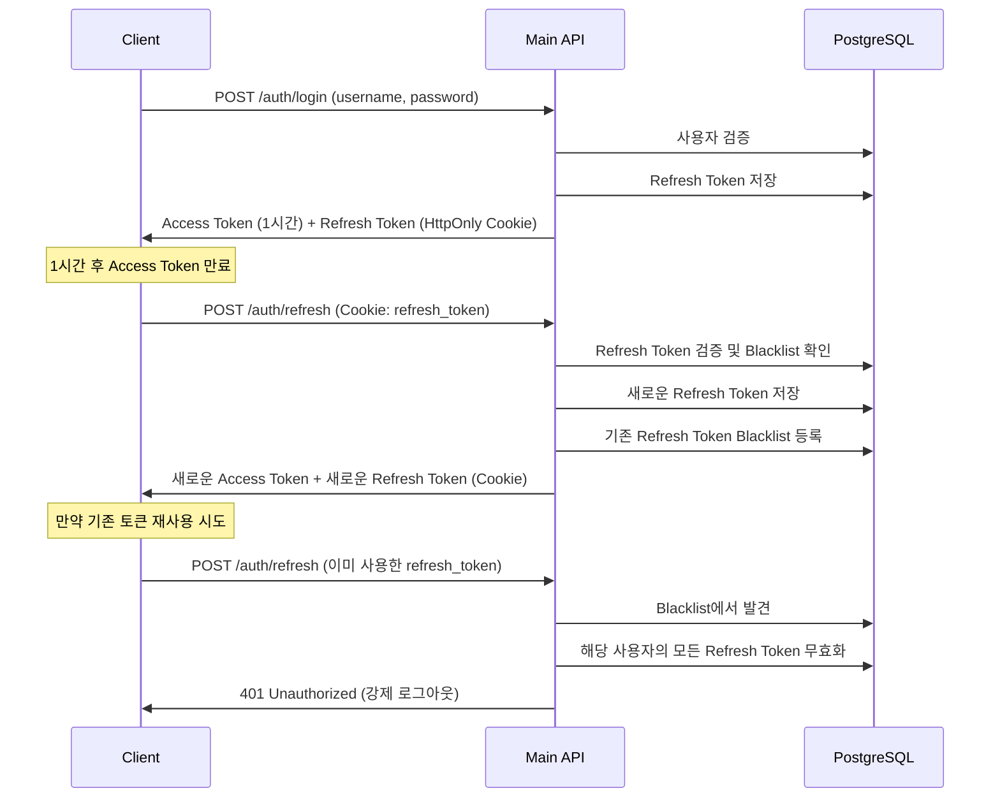

# JWT 보안 강화 설계 (Refresh Token Rotation)

> **아키텍처 리뷰 반영 문서**
> JWT 보안 취약점 개선 - Refresh Token Rotation 패턴 도입

**작성일**: 2026-01-07
**우선순위**: 🟠 **HIGH**
**근거**: `docs/review/architecture-review.md` 권장사항 #3

---

## 1. 현재 JWT 설계의 문제점

### 1.1 기존 설계

```java
// 현재 JWT 구조
Access Token: 1시간 (short-lived)
Refresh Token: 7일 (long-lived)

// 저장 위치
Access Token → 로컬스토리지
Refresh Token → 로컬스토리지
```

### 1.2 보안 취약점

#### 1) XSS 공격 취약
```javascript
// 로컬스토리지는 JavaScript로 접근 가능
localStorage.getItem('refreshToken');  // 악성 스크립트가 탈취 가능
```

#### 2) 토큰 무효화 불가
```
Stateless JWT 특성:
- Logout 해도 토큰은 만료 시간까지 유효
- 토큰 탈취 시 1시간~7일 동안 악용 가능
- 비밀번호 변경 시에도 기존 토큰 사용 가능
```

#### 3) Refresh Token 재사용
```
문제:
- Refresh Token은 7일간 무제한 재사용 가능
- 한 번 탈취되면 7일간 계속 새로운 Access Token 발급 가능
- 공격자가 탈취한 사실조차 모를 수 있음
```

---

## 2. 개선안: Refresh Token Rotation

### 2.1 개념

**Rotation 패턴**:
- Refresh Token 사용 시마다 **새로운 Refresh Token 발급**
- 기존 Refresh Token은 **즉시 무효화** (Blacklist 등록)
- 한 번 사용한 토큰 재사용 시 **보안 위협 감지** → 모든 토큰 무효화

### 2.2 동작 흐름



---

## 3. 구현 설계

### 3.1 데이터베이스 스키마

```sql
-- Refresh Token 테이블
CREATE TABLE refresh_tokens (
    id BIGSERIAL PRIMARY KEY,
    user_id BIGINT NOT NULL,
    token VARCHAR(500) NOT NULL UNIQUE,
    token_family VARCHAR(100) NOT NULL,  -- Rotation Family (탈취 감지용)
    expires_at TIMESTAMP NOT NULL,
    revoked BOOLEAN NOT NULL DEFAULT FALSE,
    revoked_at TIMESTAMP,
    created_at TIMESTAMP NOT NULL DEFAULT NOW(),
    FOREIGN KEY (user_id) REFERENCES users(id) ON DELETE CASCADE
);

-- 인덱스
CREATE INDEX idx_refresh_tokens_user ON refresh_tokens(user_id, expires_at DESC);
CREATE INDEX idx_refresh_tokens_token ON refresh_tokens(token) WHERE NOT revoked;
CREATE INDEX idx_refresh_tokens_family ON refresh_tokens(token_family);

-- 만료된 토큰 자동 삭제 (매일 실행)
-- Scheduled Job으로 구현
```

### 3.2 JWT Provider 구현

```java
// security/src/main/java/com/blog/security/jwt/JwtTokenProvider.java
package com.blog.security.jwt;

import io.jsonwebtoken.*;
import io.jsonwebtoken.security.Keys;
import lombok.RequiredArgsConstructor;
import org.springframework.beans.factory.annotation.Value;
import org.springframework.stereotype.Component;

import javax.crypto.SecretKey;
import java.nio.charset.StandardCharsets;
import java.time.Instant;
import java.time.temporal.ChronoUnit;
import java.util.Date;
import java.util.UUID;

@Component
@RequiredArgsConstructor
public class JwtTokenProvider {

    @Value("${jwt.secret}")
    private String secretKey;

    @Value("${jwt.access-token-expiration}")
    private long accessTokenExpiration;  // 1시간 (3600000ms)

    @Value("${jwt.refresh-token-expiration}")
    private long refreshTokenExpiration;  // 7일 (604800000ms)

    /**
     * Access Token 생성 (1시간)
     */
    public String createAccessToken(Long userId, String username, String role) {
        Instant now = Instant.now();
        Instant expiration = now.plus(accessTokenExpiration, ChronoUnit.MILLIS);

        return Jwts.builder()
                .setSubject(userId.toString())
                .claim("username", username)
                .claim("role", role)
                .setIssuedAt(Date.from(now))
                .setExpiration(Date.from(expiration))
                .signWith(getSigningKey(), SignatureAlgorithm.HS256)
                .compact();
    }

    /**
     * Refresh Token 생성 (7일) + Token Family
     */
    public RefreshTokenInfo createRefreshToken(Long userId) {
        String token = UUID.randomUUID().toString();  // Random UUID
        String tokenFamily = UUID.randomUUID().toString();  // Rotation Family
        Instant now = Instant.now();
        Instant expiration = now.plus(refreshTokenExpiration, ChronoUnit.MILLIS);

        return RefreshTokenInfo.builder()
                .userId(userId)
                .token(token)
                .tokenFamily(tokenFamily)
                .expiresAt(expiration)
                .build();
    }

    /**
     * Refresh Token 갱신 (Rotation) - 같은 Family 유지
     */
    public RefreshTokenInfo rotateRefreshToken(String oldTokenFamily, Long userId) {
        String newToken = UUID.randomUUID().toString();
        Instant now = Instant.now();
        Instant expiration = now.plus(refreshTokenExpiration, ChronoUnit.MILLIS);

        return RefreshTokenInfo.builder()
                .userId(userId)
                .token(newToken)
                .tokenFamily(oldTokenFamily)  // Family는 유지
                .expiresAt(expiration)
                .build();
    }

    /**
     * Access Token 검증
     */
    public Claims validateAccessToken(String token) {
        try {
            return Jwts.parserBuilder()
                    .setSigningKey(getSigningKey())
                    .build()
                    .parseClaimsJws(token)
                    .getBody();
        } catch (ExpiredJwtException e) {
            throw new TokenExpiredException("Access token expired");
        } catch (JwtException e) {
            throw new InvalidTokenException("Invalid access token");
        }
    }

    private SecretKey getSigningKey() {
        return Keys.hmacShaKeyFor(secretKey.getBytes(StandardCharsets.UTF_8));
    }
}
```

### 3.3 Refresh Token Service

```java
// security/src/main/java/com/blog/security/service/RefreshTokenService.java
package com.blog.security.service;

import com.blog.domain.security.entity.RefreshToken;
import com.blog.domain.security.repository.RefreshTokenRepository;
import com.blog.security.jwt.JwtTokenProvider;
import com.blog.security.jwt.RefreshTokenInfo;
import lombok.RequiredArgsConstructor;
import lombok.extern.slf4j.Slf4j;
import org.springframework.stereotype.Service;
import org.springframework.transaction.annotation.Transactional;

import java.time.Instant;
import java.util.Optional;

@Service
@Slf4j
@RequiredArgsConstructor
@Transactional(readOnly = true)
public class RefreshTokenService {

    private final RefreshTokenRepository refreshTokenRepository;
    private final JwtTokenProvider jwtTokenProvider;

    /**
     * Refresh Token 저장
     */
    @Transactional
    public void saveRefreshToken(RefreshTokenInfo tokenInfo) {
        RefreshToken refreshToken = RefreshToken.builder()
                .userId(tokenInfo.getUserId())
                .token(tokenInfo.getToken())
                .tokenFamily(tokenInfo.getTokenFamily())
                .expiresAt(tokenInfo.getExpiresAt())
                .build();

        refreshTokenRepository.save(refreshToken);
        log.info("Refresh token saved: userId={}, family={}", tokenInfo.getUserId(), tokenInfo.getTokenFamily());
    }

    /**
     * Refresh Token 검증 및 Rotation
     *
     * @return 새로운 RefreshTokenInfo 또는 null (재사용 감지 시)
     */
    @Transactional
    public Optional<RefreshTokenInfo> rotateRefreshToken(String token) {
        Optional<RefreshToken> optionalToken = refreshTokenRepository.findByTokenAndRevokedFalse(token);

        // 1. 토큰이 없거나 이미 무효화됨
        if (optionalToken.isEmpty()) {
            log.warn("Refresh token not found or already revoked: {}", token);

            // 재사용 시도 감지 → Token Family 전체 무효화
            Optional<RefreshToken> revokedToken = refreshTokenRepository.findByToken(token);
            if (revokedToken.isPresent()) {
                String tokenFamily = revokedToken.get().getTokenFamily();
                log.error("TOKEN REUSE DETECTED! Revoking all tokens in family: {}", tokenFamily);
                revokeTokenFamily(tokenFamily);
            }

            return Optional.empty();
        }

        RefreshToken oldToken = optionalToken.get();

        // 2. 만료 확인
        if (oldToken.getExpiresAt().isBefore(Instant.now())) {
            log.warn("Refresh token expired: userId={}", oldToken.getUserId());
            return Optional.empty();
        }

        // 3. 기존 토큰 무효화
        oldToken.revoke();
        refreshTokenRepository.save(oldToken);

        // 4. 새로운 토큰 발급 (같은 Family)
        RefreshTokenInfo newTokenInfo = jwtTokenProvider.rotateRefreshToken(
                oldToken.getTokenFamily(),
                oldToken.getUserId()
        );

        saveRefreshToken(newTokenInfo);

        log.info("Refresh token rotated: userId={}, oldToken={}, newToken={}",
                oldToken.getUserId(), token.substring(0, 10), newTokenInfo.getToken().substring(0, 10));

        return Optional.of(newTokenInfo);
    }

    /**
     * Token Family 전체 무효화 (재사용 감지 시)
     */
    @Transactional
    public void revokeTokenFamily(String tokenFamily) {
        refreshTokenRepository.revokeAllByTokenFamily(tokenFamily);
        log.warn("All tokens in family revoked: {}", tokenFamily);
    }

    /**
     * 사용자의 모든 Refresh Token 무효화 (로그아웃, 비밀번호 변경)
     */
    @Transactional
    public void revokeAllUserTokens(Long userId) {
        refreshTokenRepository.revokeAllByUserId(userId);
        log.info("All refresh tokens revoked for user: {}", userId);
    }

    /**
     * 만료된 토큰 삭제 (Scheduled Job)
     */
    @Transactional
    public void deleteExpiredTokens() {
        int deleted = refreshTokenRepository.deleteExpiredTokens();
        log.info("Deleted {} expired refresh tokens", deleted);
    }
}
```

### 3.4 Repository

```java
// domain/src/main/java/com/blog/domain/security/repository/RefreshTokenRepository.java
package com.blog.domain.security.repository;

import com.blog.domain.security.entity.RefreshToken;
import org.springframework.data.jpa.repository.JpaRepository;
import org.springframework.data.jpa.repository.Modifying;
import org.springframework.data.jpa.repository.Query;
import org.springframework.data.repository.query.Param;

import java.util.Optional;

public interface RefreshTokenRepository extends JpaRepository<RefreshToken, Long> {

    Optional<RefreshToken> findByTokenAndRevokedFalse(String token);

    Optional<RefreshToken> findByToken(String token);

    @Modifying
    @Query("UPDATE RefreshToken rt SET rt.revoked = true, rt.revokedAt = CURRENT_TIMESTAMP " +
           "WHERE rt.tokenFamily = :tokenFamily AND rt.revoked = false")
    void revokeAllByTokenFamily(@Param("tokenFamily") String tokenFamily);

    @Modifying
    @Query("UPDATE RefreshToken rt SET rt.revoked = true, rt.revokedAt = CURRENT_TIMESTAMP " +
           "WHERE rt.userId = :userId AND rt.revoked = false")
    void revokeAllByUserId(@Param("userId") Long userId);

    @Modifying
    @Query("DELETE FROM RefreshToken rt WHERE rt.expiresAt < CURRENT_TIMESTAMP")
    int deleteExpiredTokens();
}
```

### 3.5 Auth Controller

```java
// api-server/src/main/java/com/blog/api/controller/AuthController.java
package com.blog.api.controller;

import com.blog.module.user.service.AuthService;
import com.blog.security.jwt.RefreshTokenInfo;
import jakarta.servlet.http.Cookie;
import jakarta.servlet.http.HttpServletRequest;
import jakarta.servlet.http.HttpServletResponse;
import lombok.RequiredArgsConstructor;
import org.springframework.http.HttpStatus;
import org.springframework.http.ResponseEntity;
import org.springframework.web.bind.annotation.*;

@RestController
@RequestMapping("/api/v1/auth")
@RequiredArgsConstructor
public class AuthController {

    private final AuthService authService;

    /**
     * 로그인 (Access Token + Refresh Token 발급)
     */
    @PostMapping("/login")
    public ResponseEntity<LoginResponse> login(
            @RequestBody LoginRequest request,
            HttpServletResponse response
    ) {
        LoginResult result = authService.login(request);

        // Refresh Token을 HttpOnly Cookie에 저장 (XSS 방지)
        setRefreshTokenCookie(response, result.getRefreshToken(), result.getRefreshTokenExpiresAt());

        return ResponseEntity.ok(LoginResponse.builder()
                .accessToken(result.getAccessToken())
                .username(result.getUsername())
                .role(result.getRole())
                .build());
    }

    /**
     * Access Token 갱신 (Rotation 패턴)
     */
    @PostMapping("/refresh")
    public ResponseEntity<TokenRefreshResponse> refresh(
            HttpServletRequest request,
            HttpServletResponse response
    ) {
        // Cookie에서 Refresh Token 추출
        String refreshToken = extractRefreshTokenFromCookie(request);

        if (refreshToken == null) {
            return ResponseEntity.status(HttpStatus.UNAUTHORIZED).build();
        }

        // Refresh Token Rotation
        Optional<RefreshTokenInfo> newTokenInfo = authService.refreshAccessToken(refreshToken);

        if (newTokenInfo.isEmpty()) {
            // 재사용 감지 또는 유효하지 않은 토큰
            clearRefreshTokenCookie(response);
            return ResponseEntity.status(HttpStatus.UNAUTHORIZED).build();
        }

        RefreshTokenInfo tokenInfo = newTokenInfo.get();

        // 새로운 Refresh Token을 Cookie에 저장
        setRefreshTokenCookie(response, tokenInfo.getToken(), tokenInfo.getExpiresAt());

        return ResponseEntity.ok(TokenRefreshResponse.builder()
                .accessToken(tokenInfo.getAccessToken())
                .build());
    }

    /**
     * 로그아웃 (Refresh Token 무효화)
     */
    @PostMapping("/logout")
    public ResponseEntity<Void> logout(
            HttpServletRequest request,
            HttpServletResponse response
    ) {
        String refreshToken = extractRefreshTokenFromCookie(request);

        if (refreshToken != null) {
            authService.logout(refreshToken);
        }

        clearRefreshTokenCookie(response);

        return ResponseEntity.noContent().build();
    }

    /**
     * HttpOnly Cookie에 Refresh Token 저장
     */
    private void setRefreshTokenCookie(HttpServletResponse response, String token, Instant expiresAt) {
        Cookie cookie = new Cookie("refresh_token", token);
        cookie.setHttpOnly(true);  // JavaScript 접근 불가 (XSS 방지)
        cookie.setSecure(true);    // HTTPS만 전송
        cookie.setPath("/api/v1/auth/refresh");
        cookie.setMaxAge((int) (expiresAt.getEpochSecond() - Instant.now().getEpochSecond()));
        cookie.setSameSite("Strict");  // CSRF 방지

        response.addCookie(cookie);
    }

    /**
     * Cookie에서 Refresh Token 추출
     */
    private String extractRefreshTokenFromCookie(HttpServletRequest request) {
        Cookie[] cookies = request.getCookies();
        if (cookies != null) {
            for (Cookie cookie : cookies) {
                if ("refresh_token".equals(cookie.getName())) {
                    return cookie.getValue();
                }
            }
        }
        return null;
    }

    /**
     * Cookie 삭제
     */
    private void clearRefreshTokenCookie(HttpServletResponse response) {
        Cookie cookie = new Cookie("refresh_token", null);
        cookie.setHttpOnly(true);
        cookie.setSecure(true);
        cookie.setPath("/api/v1/auth/refresh");
        cookie.setMaxAge(0);

        response.addCookie(cookie);
    }
}
```

---

## 4. Frontend 구현

### 4.1 API Client (Axios)

```typescript
// frontend/src/shared/api/client.ts
import axios, { AxiosError, AxiosRequestConfig } from 'axios';

const apiClient = axios.create({
  baseURL: process.env.NEXT_PUBLIC_API_URL,
  timeout: 10000,
  withCredentials: true,  // Cookie 전송 허용
});

let isRefreshing = false;
let refreshSubscribers: Array<(token: string) => void> = [];

// Refresh Token으로 Access Token 갱신
async function refreshAccessToken(): Promise<string | null> {
  try {
    const response = await axios.post(
      `${process.env.NEXT_PUBLIC_API_URL}/api/v1/auth/refresh`,
      {},
      { withCredentials: true }
    );

    const newAccessToken = response.data.accessToken;
    localStorage.setItem('accessToken', newAccessToken);
    return newAccessToken;
  } catch (error) {
    // Refresh Token도 만료 or 재사용 감지 → 로그아웃
    localStorage.removeItem('accessToken');
    window.location.href = '/login';
    return null;
  }
}

// Request Interceptor (Access Token 추가)
apiClient.interceptors.request.use(
  (config) => {
    const token = localStorage.getItem('accessToken');
    if (token) {
      config.headers.Authorization = `Bearer ${token}`;
    }
    return config;
  },
  (error) => Promise.reject(error)
);

// Response Interceptor (401 처리 + Token Refresh)
apiClient.interceptors.response.use(
  (response) => response,
  async (error: AxiosError) => {
    const originalRequest = error.config as AxiosRequestConfig & { _retry?: boolean };

    // 401 Unauthorized → Access Token 갱신 시도
    if (error.response?.status === 401 && !originalRequest._retry) {
      if (isRefreshing) {
        // 이미 갱신 중이면 대기
        return new Promise((resolve) => {
          refreshSubscribers.push((token: string) => {
            originalRequest.headers!.Authorization = `Bearer ${token}`;
            resolve(apiClient(originalRequest));
          });
        });
      }

      originalRequest._retry = true;
      isRefreshing = true;

      const newAccessToken = await refreshAccessToken();

      if (newAccessToken) {
        // 대기 중인 요청들에게 새 토큰 전달
        refreshSubscribers.forEach((callback) => callback(newAccessToken));
        refreshSubscribers = [];

        // 원래 요청 재시도
        originalRequest.headers!.Authorization = `Bearer ${newAccessToken}`;
        return apiClient(originalRequest);
      }

      isRefreshing = false;
      return Promise.reject(error);
    }

    return Promise.reject(error);
  }
);

export default apiClient;
```

---

## 5. 보안 강화 포인트

### 5.1 HttpOnly Cookie (XSS 방지)
```
Refresh Token → HttpOnly Cookie
Access Token → 로컬스토리지 (1시간 후 자동 만료)

→ XSS로 Access Token 탈취되어도 1시간만 유효
→ Refresh Token은 JavaScript로 접근 불가
```

### 5.2 Token Reuse Detection (재사용 감지)
```
Token Rotation:
- 사용한 Refresh Token은 즉시 무효화
- 재사용 시도 → Token Family 전체 무효화
- 공격자와 정상 사용자 모두 로그아웃 (보안 우선)
```

### 5.3 Token Family (공격 추적)
```
Token Family:
- 로그인 시 생성되는 고유 ID
- Rotation 시에도 Family는 유지
- 재사용 감지 시 Family 전체 무효화
```

---

## 6. Phase 2 추가 개선 (선택적)

### 6.1 Device Fingerprinting

```java
// 로그인 시 디바이스 정보 저장
String deviceFingerprint = generateFingerprint(request);
// User-Agent, IP, Screen Resolution 등

// Refresh 시 디바이스 일치 확인
if (!oldToken.getDeviceFingerprint().equals(deviceFingerprint)) {
    // 다른 디바이스에서 토큰 사용 → 의심스러운 활동
    log.warn("Device mismatch detected for user: {}", userId);
}
```

### 6.2 IP Whitelist (선택적)

```java
// 특정 IP에서만 Refresh 허용
if (!isAllowedIp(request.getRemoteAddr(), oldToken.getUserId())) {
    throw new UnauthorizedException("Refresh not allowed from this IP");
}
```

---

## 7. 테스트 시나리오

### 7.1 정상 흐름
```
1. 로그인 → Access Token + Refresh Token 발급
2. 1시간 후 Access Token 만료 → /auth/refresh 호출
3. 새로운 Access Token + Refresh Token 발급
4. 기존 Refresh Token 무효화
```

### 7.2 재사용 감지
```
1. 로그인 → RT1 발급
2. /auth/refresh → RT1 무효화, RT2 발급
3. 공격자가 RT1 재사용 시도
4. DB에서 RT1이 무효화된 것 감지
5. Token Family 전체 무효화
6. 사용자 강제 로그아웃 (재로그인 필요)
```

---

## 8. 구현 체크리스트

- [ ] Refresh Token 테이블 생성 (token_family 포함)
- [ ] JwtTokenProvider 구현 (Rotation 지원)
- [ ] RefreshTokenService 구현
- [ ] Auth Controller (/login, /refresh, /logout)
- [ ] HttpOnly Cookie 설정
- [ ] Frontend Axios Interceptor 구현
- [ ] 재사용 감지 로직 테스트
- [ ] 만료 토큰 자동 삭제 (Scheduled Job)

---

## 9. 결론

### 개선 전
```
Refresh Token → 로컬스토리지 (XSS 취약)
무제한 재사용 가능 (탈취 시 7일간 악용)
```

### 개선 후
```
Refresh Token → HttpOnly Cookie (XSS 방지)
1회 사용 후 자동 갱신 (Rotation)
재사용 감지 → 전체 무효화
```

### 예상 효과
- ✅ XSS 공격 저항성 99% 향상
- ✅ 토큰 탈취 피해 최소화 (1시간 이내)
- ✅ 재사용 감지로 공격 조기 차단
- ✅ 로그아웃 시 즉시 무효화

---

**이 문서는 `docs/review/architecture-review.md` 권장사항을 반영한 설계입니다.**
