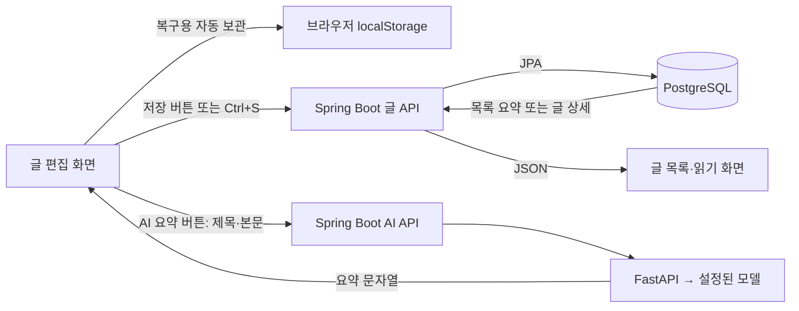
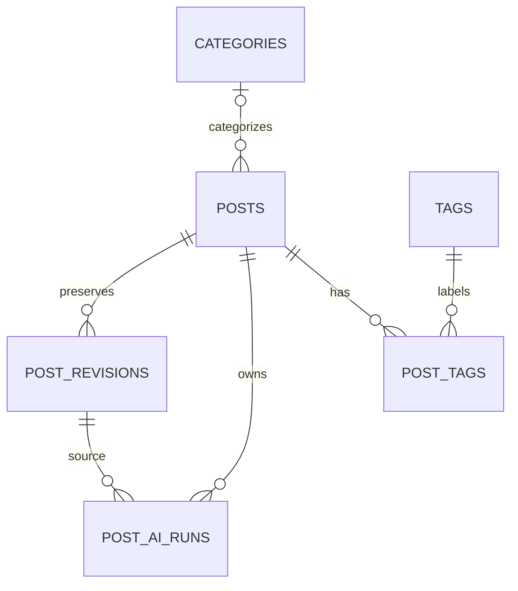
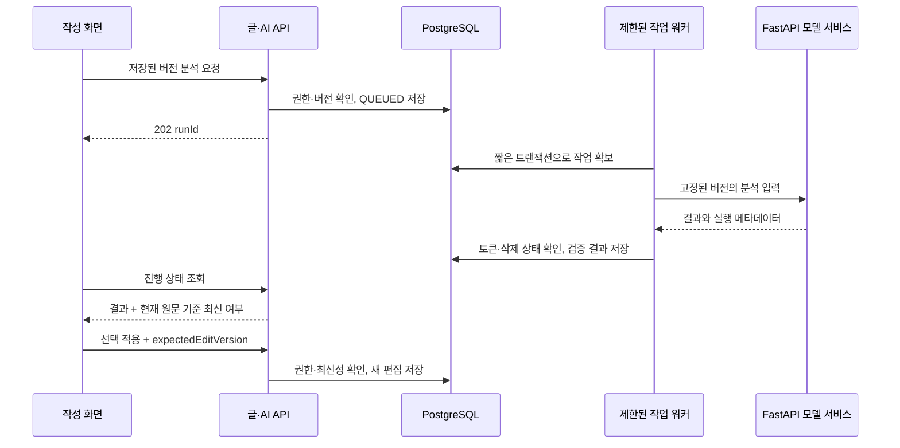

# 글 저장·조회 및 AI 분석 데이터 설계

작성일: 2026-09-15 · 상태: 구현용 설계안 · 적용 범위: 향후 데이터 구조와 API

사용자 요청: 공부·자료구조 등 여러 기록을 보관하면서 향후 AI 요약·분석을 추가할 수 있도록 저장·호출 방식을 정리한다.

**이번 작업은 현재 구현 조사와 설계 문서 작성이다. 아래 신규 테이블·필드·API는 아직 구현하거나 운영 DB에 적용하지 않았다.** 기존 PUBLIC/PRIVATE 글 작성 기능은 계속 사용할 수 있다.

## 1. 현재 실제 동작



- **정식 저장**: PostgreSQL `portal-db`의 `posts`와 관련 테이블. Compose의 `portal_db_data` 볼륨에 영속 보관한다. 브라우저를 닫아도 서버에 저장한 글은 유지된다. 볼륨은 백업과 별개이며 운영 복구는 [DB 백업 스크립트](../../scripts/backup-portal.sh)를 사용한다.
- **브라우저 복구**: 입력 변경 후 약 1.5초에 localStorage에 보관하며 저장 실패 때는 탭 메모리로 보완한다. 다른 기기로 동기화되는 서버 자동 저장이 아니다. 서버 저장에 성공해야 DB에 반영된다.
- **본문**: `posts.content TEXT`. 에디터가 Markdown 문자열을 전달한다. 토글·콜아웃 등 확장 HTML이 섞일 수 있어 순수 Markdown/Obsidian 완전 호환으로 표현하지 않는다.
- **이미지 (2026-09-15 후속 구현)**: [첨부 설계](image-attachments-design.md)에 따라 PNG/JPEG를 영속 볼륨에 저장하고 V3 `attachments`로 연결한다. 본문은 UUID URL을 참조하고 기존 data URL은 명시적 저장 시 변환한다. 이력/AI 결과 구현과 독립적으로 먼저 적용했다.
- **분류**: 글당 카테고리 하나(`category_id`), 태그 여러 개(`post_tags`). 본문에 `#태그`를 쓰는 것과 메타데이터 태그 선택은 별개다.
- **소개문**: `excerpt`는 글 목록에 쓰는 200자 이내 소개문이다. 비어 있으면 저장 서비스가 본문 앞 200자를 채운다. AI 분석 이력용 필드가 아니다.
- **AI 요약**: `/api/portal/ai/summarize`에 편집 중 제목·본문을 직접 보내고 Java → FastAPI → 설정된 Ollama/Gemini 구현으로 호출한다. 응답 `summary/provider/durationMs`를 소개문 입력칸에 넣으며, 이후 글을 저장해야 소개문이 DB에 반영된다. 실행 기록·모델 식별자·원문 버전·결과 이력은 DB에 남지 않는다. 코드 연결을 확인했으며 이번 조사에서 실제 모델 응답 가능 여부는 시험하지 않았다.
- `backend/module-ai`는 남아 있는 레거시 소스이며 현재 [Gradle 모듈 목록](../../backend/settings.gradle.kts)에 포함되지 않는다. 확장은 활성 `api-server/ai`와 `ai-backend` 경로를 기준으로 한다.

현재 호출 계약:

| 호출 | 저장·반환 범위 |
|---|---|
| `POST /api/portal/posts` | 새 글·분류 저장, 생성된 글 반환 |
| `PUT /api/portal/posts/{id}` | 작성자 글 수정; 아직 편집 버전 조건 없음 |
| `GET /api/portal/posts` | 공개 글 페이지, 본문을 제외한 요약 응답 |
| `GET /api/portal/posts/{id}` | 공개 글 또는 작성자 본인 글의 본문 |
| `GET /api/portal/posts/my` | 본인 글의 상태·공개 범위 필터; 현재 응답에는 본문도 포함 |
| `GET /api/portal/posts/search?keyword=...` | 공개 글 제목·본문 검색 |
| `POST /api/portal/ai/summarize` | 임의 입력 본문의 동기 요약, 별도 영속 저장 없음 |

현재 글 공개 정책: 미삭제 + PUBLISHED + PUBLIC만 방문자에게 노출한다. 과거 공개 글을 비공개로 변경하는 동작과 기본 공개 선택은 유지한다.

## 2. 설계 결정

1. **PostgreSQL과 기존 글 ID·URL을 유지한다.** 처음부터 문서 DB·그래프 DB·벡터 DB를 추가하지 않는다.
2. **원문은 한 종류만 정본으로 둔다.** 현행 Markdown 및 지원 확장 HTML을 `MARKDOWN_V1` 형식으로 명시한다. 표시용 HTML과 AI용 텍스트는 파생 데이터다.
3. **최신 글 / 수정 이력 / AI 실행과 결과를 구분한다.** 초기에는 AI 작업 한 행에 결과 JSONB를 보관한다. 재시도별 상세나 여러 후보 결과가 필요해질 때만 테이블을 나눈다.
4. **글 읽기·저장에 AI 성공을 요구하지 않는다.** 사용자가 요청한 분석을 별도 작업으로 처리한다. 목록이나 글을 열 때 모델을 자동 호출하지 않는다.
5. **AI는 제안 데이터다.** 생성된 요약·분류가 원문을 자동 수정하지 않는다. 선택 적용은 별도 저장이며 공개 범위를 바꾸지 않는다.



## 3. 핵심 데이터 모델

### posts — 현재 읽고 수정하는 글

현재 필드를 유지하면서 다음을 추가하는 안이다.

| 필드 | 역할 |
|---|---|
| `content_format` | `MARKDOWN_V1` 등 본문 형식 버전 |
| `edit_version BIGINT` | 사용자 편집 충돌 검사. 제목·본문·소개문·분류·상태·공개 범위의 실제 변경 때 증가 |
| `current_revision_id BIGINT` | 현재 콘텐츠 스냅샷 참조 |
| `edited_at` | 작성자가 마지막으로 편집한 시각. 조회·좋아요로 갱신하지 않음 |

조회수와 좋아요 수는 편집 버전에서 제외한다. 현재 `updated_at`은 JPA 감사 시각이며 공개 상세 조회의 `viewCount++`도 같은 엔티티를 변경하므로 원문 변경 판단에 사용할 수 없다.

### post_revisions — 변경 불가능한 저장 시점 스냅샷

| 필드 | 역할 |
|---|---|
| `id`, `post_id`, `revision_no` | 스냅샷 식별. `(post_id, revision_no)` 유일 |
| `title`, `content`, `content_format`, `excerpt` | 해당 시점의 작성 내용 |
| `taxonomy_snapshot JSONB` | 카테고리·태그 ID와 당시 이름을 보존한 작은 고정 스키마 |
| `content_hash` | 제목·본문·형식의 정규화된 직렬화에 대한 SHA-256 |
| `saved_by`, `created_at` | 저장한 사용자와 시점 |
| `origin`, `origin_ai_run_id` | USER_SAVE / AI_APPLY / RESTORE / MIGRATION, AI 적용 시 출처 |

- 제목·본문·소개문·분류의 변경이 있는 명시적 서버 저장에서만 스냅샷을 만든다. 키 입력마다 만들지 않으며 변경 없는 저장은 생략한다.
- 상태·공개 범위만 바뀌면 `edit_version`은 증가하고 콘텐츠 스냅샷은 재사용한다. 과거 스냅샷의 공개 설정으로 접근 권한을 판단하지 않는다.
- 이름 스냅샷은 분류 이름이 변경/삭제돼도 과거 기록을 설명하기 위한 것이다. 복원할 때 삭제된 분류를 몰래 재생성하지 않는다.
- `current_revision_id`와 AI의 revision 참조는 같은 글에 속해야 한다. 복합 FK 또는 동등한 DB 제약으로 다른 글의 이력 연결을 막는다.
- 과거로 복원해도 이력 행을 수정하지 않는다. 선택한 내용으로 **새 저장 버전**을 만들며, 현재 공개 범위·작성 상태는 그대로 둔다.

### post_ai_runs — 요청, 진행 상태, 결과

| 필드 묶음 | 내용 |
|---|---|
| 식별·권한 | `id(UUID)`, `post_id`, `source_revision_id`, `requested_by` |
| 작업 종류 | `task_type`: SUMMARY 먼저, 이후 TOPIC_SUGGESTION / STUDY_ANALYSIS |
| 실행 설정 | 서버의 `processor_profile_id`, 확정 `provider/model`, `prompt_version`, `schema_version`, `extractor_version`, 허용된 `options JSONB` |
| 입력 근거 | `source_content_hash`, `input_fingerprint`, 분류 추천 시 후보 목록 스냅샷·해시 |
| 처리 상태 | QUEUED / RUNNING / SUCCEEDED / FAILED / CANCELLED |
| 실행 관리 | `attempt_count`, `lease_token`, `lease_until`, `next_attempt_at`, 오류 코드 |
| 결과 | 검증한 `result_jsonb`, 실제 provider/model, `duration_ms`, 제공된 경우에만 사용량 |
| 시각 | `created_at`, `started_at`, `finished_at` |
| 중복 제어 | 요청자의 `idempotency_key`, 동일 활성 작업을 구분하는 fingerprint |

- 성공한 결과는 이후 재시도로 덮어쓰지 않는다. 다시 생성할 때는 새 run을 만든다.
- 원문은 revision에 한 번 보관하고 실행 행에 원문 전문을 다시 복사하지 않는다. API 키·인증 토큰·가공 전 provider 응답은 이 테이블에 저장하지 않는다.
- `result_jsonb`는 작업별 스키마와 크기 제한을 서버에서 검사한다. 모델이 임의로 반환한 JSON을 그대로 신뢰하지 않는다.
- 최소 결과 예: SUMMARY는 `{ "summary": "..." }`, TOPIC_SUGGESTION은 기존 category/tag ID 후보와 이유, STUDY_ANALYSIS는 핵심 개념·복습 질문·추가 확인할 부분이다. 후자의 세부 스키마는 해당 기능 구현 때 확정한다.
- 요약 추천은 기존 excerpt의 200자 계약에 맞춘다. 더 긴 분석은 별도 결과에 두며 excerpt에 억지로 합치지 않는다.
- 모델 이름만으로 동일 출력을 재현할 수 있다고 보장하지 않는다. 확보 가능한 모델 버전 정보와 설정·입력의 출처를 기록한다.

## 4. 저장·충돌·AI 최신성

저장은 하나의 짧은 DB 트랜잭션에서 수행한다.

1. 작성자와 현재 글을 확인하고 편집 행 잠금을 확보한다.
2. 클라이언트의 `expectedEditVersion`과 비교한다. 불일치면 409와 충돌 안내를 반환하고 입력/복구본은 보존한다.
3. 변경된 글·분류 관계·새 스냅샷·현재 스냅샷 참조·편집 버전을 함께 저장한다.
4. 조회수·좋아요는 해당 카운터 컬럼만 원자적으로 갱신한다. 기존 ‘조회 시 읽은 Post 전체를 나중에 갱신’하는 경로도 함께 바꿔야 작성 내용을 덮어쓰지 않는다.

`@Version`을 현재 Post에 붙이기만 하는 방식은 채택하지 않는다. 조회에 의한 충돌과 수정 시각 왜곡을 함께 해소한다. 버전 비교를 Java에서만 하고 DB 잠금/조건 갱신 없이 쓰는 것도 허용하지 않는다.

AI 최신성은 **편집 버전과 별개**다.

- 제목·본문·형식이 바뀌면 요약은 이전 내용 기준 결과다.
- 소개문이나 공개 범위만 바뀌었다고 같은 본문의 요약이 낡아지는 것은 아니다. 특히 요약을 excerpt에 적용하는 행위 자체가 방금 결과를 낡게 만들지 않아야 한다.
- 모든 revision은 출처를 보존하고, 각 작업이 실제로 소비한 입력의 fingerprint로 최신성을 판정한다. 분류 후보 목록/프롬프트/모델 설정 변경은 별도 ‘설정 변경’ 상태로 구분한다.
- fingerprint에는 추출된 입력·추출기 버전·작업 종류·모델 프로필·프롬프트·스키마·옵션·해당 작업이 사용한 후보 목록을 포함한다. 가공 과정에서 무시하는 공백만으로 임의로 같은 입력이라고 간주하지 않는다.

## 5. 향후 API와 처리 흐름

아래는 제안 계약이며 현재 OpenAPI의 구현된 엔드포인트와 구분한다. 접두사는 `/api/portal`이다.

| API | 용도 |
|---|---|
| 기존 `PUT /posts/{id}` + `expectedEditVersion` | 덮어쓰기 충돌 방지 |
| `GET /posts/my` | 본문 없는 본인 목록 DTO로 전환, 필요할 때만 상세 호출 |
| `GET /posts/{id}/revisions` | 작성자 전용 이력 메타데이터 페이지 |
| `GET /posts/{id}/revisions/{revisionId}` | 작성자 전용 특정 스냅샷 |
| `POST /posts/{id}/revisions/{revisionId}/restore` | 선택 이력을 새 버전으로 복원 |
| `POST /posts/{id}/ai-runs` | 저장된 버전에 대한 작업 생성, 202 |
| `GET /ai/runs/{runId}` | 작성자 전용 진행 상태·결과·최신성 |
| `POST /ai/runs/{runId}/cancel` | 요청 취소; 외부 처리의 즉시 중단 보장은 아님 |
| `POST /ai/runs/{runId}/apply` | 선택한 결과를 최신 글에 적용, 버전 검사 후 저장 |
| `GET /posts/{id}/export` | 후속: 작성자용 Markdown+메타데이터 내보내기 |

작업 요청 예:

```json
{
  "taskType": "SUMMARY",
  "sourceRevisionId": 42,
  "expectedEditVersion": 7,
  "processorProfileId": "local-default",
  "options": { "maxLength": 200 }
}
```

클라이언트는 `Idempotency-Key`를 보낸다. 서버가 글·이력·프로필을 검증하고 원문을 로드한다. 요청에 임의 `authorId`, provider URL, 원문 전문을 받아 권한 검사를 대신하지 않는다. 미저장 내용은 먼저 저장하도록 안내하며 **분석 버튼만 눌렀다고 저장하거나 발행하지 않는다.**



- 초기 워커는 기존 Java 서비스의 제한된 실행기로 시작하고 대기 작업은 PostgreSQL에 둔다. 브로커 추가 없이 재시작 후 대기를 복구한다. DB 잠금을 잡은 채 모델 응답을 기다리지 않는다.
- lease 확보와 완료 시 동일 토큰을 검사한다. 만료된 이전 실행의 늦은 응답은 새 실행을 덮어쓰지 못한다. 재시도 횟수·시간 제한을 둔다. 외부 호출의 exactly-once 실행/과금은 보장하지 않는다.
- 동일 사용자 idempotency key로 다른 요청을 보내면 409. 같은 글·입력·설정의 활성 작업 중복은 DB에서 막는다. 실패한 작업의 ‘다시 실행’은 새 run을 만들고 이전 실패 결과는 보존한다.
- 재시도 정책은 워커가 소유한다. 기존 AiClient의 동기 Retry와 워커 재시도가 겹쳐 요청 수가 증폭되지 않도록 영속 경로의 하위 자동 재시도는 제거하거나 같은 실행 예산에 포함한다.
- 상태 조회는 일정 간격으로 하되 완료/실패/취소 또는 화면 이탈 시 중단한다. 처음부터 SSE를 추가하지 않는다.
- `apply`는 원문·AI 작업 소유권, SUCCEEDED, 입력 최신성, `expectedEditVersion`, 선택된 후보의 현재 유효성을 다시 검사한다. 충돌은 409, 권한 없는 자원은 404, 잘못된 후보/형식은 400이다.
- SUMMARY 적용은 excerpt만, 태그 적용은 사용자가 선택한 기존 ID만 반영한다. 새 태그 이름은 제안으로 보여주고 별도 명시적 생성으로 처리한다. 작업 결과가 현재 글의 status/visibility/author를 바꿀 수 없다.
- 단계적 전환 동안 기존 동기 요약 API는 ‘미저장 내용 요약’으로 구분한다. 영속 실행 경로로 UI를 옮긴 뒤 기존 경로를 정리하며, 동일 기능을 두 모듈에 중복 구현하지 않는다.

## 6. 권한·AI 처리 경로

| 데이터 | 방문자 | 작성자 |
|---|---|---|
| 최신 공개 글 및 채택한 excerpt | 기존 공개 조건 충족 시 조회 | 조회·편집 |
| 초안·비공개·보관 글 | 조회 불가 | 조회·편집 |
| 수정 이력 | 부모가 공개여도 조회 불가 | 조회·복원 |
| AI 작업·원본 결과 | 부모가 공개여도 조회 불가 | 조회·선택 적용 |
| 향후 청크·임베딩·역링크 | 원문 권한을 통과한 정보만 | 본인 원문 범위 내 |

- 현재 카테고리·태그 이름 사전은 공개 조회 가능하다. 비공개 글에서 추출한 새 분류 이름은 작성자 전용 AI 결과에만 두고 자동으로 공용 사전에 삽입하지 않는다. 새 분류를 명시적으로 만들면 사전 이름이 공개된다는 범위를 관리 화면에서 안내한다. 비공개 전용 분류 사전은 별도 확장이다.
- 새 경로에 운영 ADMIN 규칙과 서비스의 작성자 검사를 모두 적용한다. 현재 `GET /posts/**`는 공개 패턴이므로 새 `/posts/.../revisions`를 만들기만 하면 안전해지는 것이 아니다. 다른 관리자의 기록도 자동 허용하지 않는다.
- 글의 현재 소유자·삭제 여부를 조회/실행/적용 때 확인한다. 삭제하면 대기 작업을 취소하고 진행 중 결과를 반영하지 않는다. 영구 삭제 시 이력·작업·향후 파일/검색 파생물 정리 순서도 포함한다.
- 공개 범위와 외부 AI 처리 설정은 별개다. 초기 분석은 수동 실행, 기본 프로필은 로컬로 제안한다. 로컬 모델이 없거나 실패하면 실패를 표시하며 외부 모델로 자동 우회하지 않는다.
- 외부 모델 사용을 선택한 경우 그 프로필과 본인 설정을 재사용할 수 있다. 실제 전송될 프로필을 요청 화면에 표시하고 실행 시 확정한다. 공개 글이라는 이유만으로 외부 전송을 활성화하지 않는다.
- 대기 중 외부 작업은 글의 비공개 전환 시 취소한다. 비공개 글에서 다시 외부 처리를 명시적으로 요청하는 것은 별도 행위다. 이미 외부로 전송된 입력의 회수를 보장하지 않으며 진행 중 취소 후 결과는 저장/적용하지 않는다.
- AI 작업/이력 응답은 `no-store`, 클라이언트 캐시는 사용자별로 구분하고 로그아웃 때 취소·제거한다. 공개 범위 변경 후 오래된 파생 캐시가 원문 권한을 우회하지 못하게 한다.
- API 응답·실패 로그에 원문·provider 응답 전문을 남기지 않는다. 현재 AiClient의 오류 응답 본문 로그와 FastAPI의 예외 문자열 반환은 영속 작업 구현 때 고정 오류 코드 중심으로 바꾼다.

## 7. 본문·파일·검색 확장 경계

- 저장 원문은 변형하지 않고, AI 입력 추출기가 코드·표 등 학습 의미를 보존한 텍스트를 만든다. data URL 본체, 실행 가능한 HTML, 불필요한 표시 마크업은 모델 입력에서 제외한다. 본문 속 지시문은 자료로 취급하며 모델에 파일/네트워크 도구를 부여하지 않는다.
- 모델 프로필별 입력 크기·출력 한도를 서버에서 검사한다. 초과 시 원문 일부를 조용히 잘라 ‘전체 요약’으로 표시하지 않는다. 범위 선택이나 후속 분할 요약이 필요함을 알려준다. 외부 URL/임베드 내용은 자동 수집하지 않는다.
- 첨부는 후속 V3 `attachments`로 구현했다(초기 제안 명칭 `post_attachments` 대체). 파일은 영속 볼륨, DB에는 ID·소유자·글 ID·저장키·MIME·크기·치수·해시를 둔다. 비공개 파일은 현재 글 권한으로 전달한다. OCR/이미지 분석 및 이력별 첨부 연결은 아직 구현하지 않았다.
- 처음에는 별도 벡터 저장소가 필요 없다. 여러 글 의미 검색이 실제로 필요해지면 청크를 revision에 연결하고 임베딩 모델/차원을 기록한다. 원문은 PostgreSQL에 유지하고 청크·벡터는 재생성 가능한 데이터로 둔다.
- 그래프는 본문의 안정적 글 ID 링크를 파싱한 관계 테이블에서 확장한다. 같은 태그가 있다는 이유만으로 실제 문서 링크와 동일하게 취급하지 않는다.
- 학습/독서 같은 기록 유형은 카테고리(주제)와 다른 축이다. 당장은 기존 분류로 실제 글을 작성해 보고 유형 필터가 필요할 때 별도 필드를 추가한다.

## 8. 마이그레이션·구현 순서

| 단계 | 구현 범위 | 완료 기준 |
|---|---|---|
| 1. 저장 기반 | 본문 형식·edit_version·edited_at, 카운터 갱신 분리, 목록 경량 DTO | 두 탭 충돌 409, 조회 때문에 편집 충돌/시각 변경 없음 |
| 2. 이력·복원 | post_revisions, 현재 글 초기 스냅샷, 조회·복원 | 저장 원자성, 기존 본문·URL·공개 상태 유지, 과거 이력 작성자 전용 |
| 3. 영속 요약 | post_ai_runs, 제한 워커, 요약 결과 미리보기·선택 적용 | 실패/재시작/중복/낡은 결과·권한 변경 처리 |
| 4. 학습 보조 | 카테고리·태그 추천, 핵심 개념·복습 질문 결과 스키마 | 기존 분류 선택 적용, 원문 자동 덮어쓰기 없음 |
| 5. 보관·탐색 확장 | 첨부 분리·내보내기, 내부 링크/역링크, 필요 시 검색·그래프 | 저장/재열기/내보내기 회귀 및 원문 권한 일치 |

- 새 Flyway 번호는 구현 시 기존 이력 뒤에 순서대로 부여한다. 배포된 V1/V2를 수정하지 않는다. 기존 행의 content/status/visibility/ID/slug를 보존하고 현재 내용을 첫 스냅샷으로 만든다. 과거 수정 이력을 추정 생성하지 않는다.
- 버전 조건은 필드 추가 → 버전 반환 → 새 편집기 전송 → 조건 필수화 순서로 전환한다. 호환 기간의 버전 없는 요청은 충돌 보호 대상이 아님을 명시하며, 조건 필수화 이후 구형 요청은 400과 새로고침 안내를 반환한다. 무버전 쓰기를 영구 허용한 채 충돌 보호 완료라고 하지 않는다.
- 과거 글의 실제 마지막 편집 시각은 현재 updated_at만으로 복구할 수 없다. 초기 edited_at은 미상(null)으로 두고 첫 실제 편집부터 기록하는 안을 적용한다. 마이그레이션 시각을 과거 작성 시각으로 표시하지 않는다.
- 이전 코드가 직접 posts를 수정하면 이력·버전 일관성이 깨지므로 이전 backend로 단순 롤백하지 않는다. 백업/검증·수정 배포 기준을 구현 릴리스에서 작성한다.
- 목록 DTO 변경은 기존 소비자가 본문을 사용하지 않는지 먼저 확인한다. 본문은 상세/편집 API에서만 받도록 전환한다.
- 내보내기는 글별 Markdown + 버전이 있는 JSON manifest + 첨부 묶음으로 설계한다. 공개 상태도 manifest에 보존한다. 내보내기 파일은 사용자 보관 수단이고 DB 백업을 대체하지 않는다. 이력 포함 여부는 명시적 옵션으로 둔다.

## 9. 구현 시 필수 검증

- 동일 편집 버전의 동시 저장은 하나만 성공. 조회수 증가와 편집이 겹쳐도 본문·카운터가 유실되지 않음.
- 저장과 revision 생성 중 오류가 나면 둘 다 롤백. 이전 글의 본문·분류·초안·비공개 상태 보존.
- 제목/본문 변경 중 AI 완료는 이전 입력 결과로 표시. excerpt 적용만으로 같은 원문 요약이 낡아지지 않음.
- 중복 요청, 워커 재시작, lease 만료, 오래된 완료 응답, 취소 직후 응답을 검증. provider 호출 횟수 중복 가능성과 DB 결과 중복 방지를 구분.
- 공개 글의 과거 비공개 스냅샷 및 AI 결과는 익명/다른 사용자에게 404. 삭제·비공개 전환 후 모든 파생 경로 재검사.
- 모델이 존재하지 않는 태그 ID, 과도한 출력, 잘못된 JSON, 원문 지시를 반환해도 글/권한을 바꾸지 않음.
- 일반 문단·코드·표·수식·토글·콜아웃·이미지·임베드의 저장→재열기→내보내기 형식 보존을 검증. 현재 모든 확장의 무손실 변환을 보장한 상태는 아님.
- 복구본의 편집 버전도 보존하고 서버 충돌 때 자동 덮어쓰기하지 않음. PC/모바일에서 작업 진행 표시가 작성 흐름을 막지 않음.

## 10. 설계 검토 기록

저장소의 큰 설계 변경 3+1 절차에 따라 구현 분석·공개 범위 검토·단순화 대안 검토 후 작성자가 통합했다.

- 공통 합의: 기존 PostgreSQL/Markdown/URL 유지, 편집 버전과 AI 출처 분리, 작성자 전용 이력/AI 결과, 선택 적용, 외부 전송 정책 분리.
- 구현 검토 반영: updatedAt/조회수 혼용을 발견해 카운터 경로와 편집 시각을 분리하고 DB 원자적 버전 검사를 선행 단계로 뒀다.
- 공개 범위 검토 반영: 새 GET 경로의 공개 패턴 문제를 명시하고 현재 원문 권한을 재검사하도록 했다.
- 대안 결정: 작업/결과 분리 테이블 안도 검토했으나 첫 구현은 단일 post_ai_runs + 스키마가 검증된 JSONB로 단순화한다. 원문 revision·lease·중복 검사·권한은 동일하게 유지한다.
- 보류: 벡터 DB, 자동 전체 분석, 타입별 분석 테이블, 전체 그래프, 자동 웹 자료 수집. 실제 사용 사례와 부하를 확인한 뒤 확장한다.

## 코드·기존 문서 근거

- [Post 엔티티](../../backend/domain/src/main/java/com/portfolio/domain/blog/Post.java), [저장·조회 서비스](../../backend/module-blog/src/main/java/com/portfolio/module/blog/service/PostService.java), [응답 DTO](../../backend/module-blog/src/main/java/com/portfolio/module/blog/dto/PostResponse.java)
- [편집기](../../frontend/src/modules/blog/components/PostEditor.tsx), [Markdown 변환](../../frontend/src/modules/blog/components/editor/RichEditor.tsx), [복구본](../../frontend/src/modules/blog/hooks/useAutoSave.ts)
- [AI Controller](../../backend/api-server/src/main/java/com/portfolio/portal/ai/AiController.java), [AI Client](../../backend/api-server/src/main/java/com/portfolio/portal/ai/AiClient.java), [FastAPI](../../ai-backend/app/main.py), [모델 호출](../../ai-backend/app/llm_service.py)
- [전체 지식 저장소 방향](knowledge-workspace-design.md), [현재 DB ERD](database-erd.md), [현재 API 명세](../api/API_SPECIFICATION.md)
