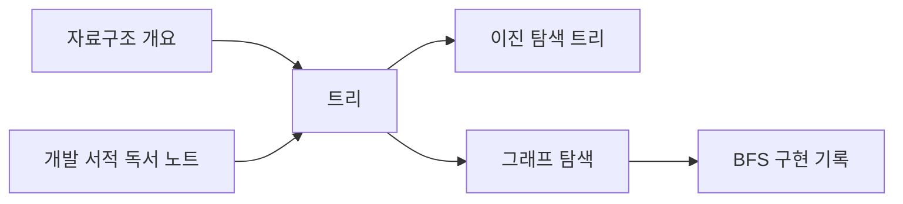

# 블로그를 개인 지식 저장소로 확장하는 설계 초안

작성일: 2026-09-14 · 업데이트: 2026-09-15 · 상태: 공개 범위 분리·내 기록 구현 / 링크·그래프는 후속 설계

## 확정된 사용자 요구

- 자료구조·개발 공부·독서·여러 종류의 기록을 장기간 대량 보관한다.
- 문서 간 관계를 연결하고 Obsidian처럼 그래프로 탐색한다.
- **공개가 기본이며 선택한 글을 비공개로 설정한다.** 사용자 답변으로 확정했다. 작성 중 초안은 기존처럼 비공개이고, 명시적으로 발행한 글의 기본 공개 범위가 공개라는 의미로 적용한다.
- 방문자는 조회만, 작성·관리는 기존 관리자만 가능하다.
- 포트폴리오에 기원테크·트러스트에이아이에서의 기록을 포함한다. 현재 재직 중이라고 표현하지 않는다. 근무 형태·기간·역할·성과는 추가 자료로 확인한다.

이 문서는 지식 저장소의 목표를 담는다. 공개 범위 분리와 내 기록 필터는 2026-09-15 구현했으며, 링크·그래프·변경 이력은 후속 계획이다.

## 최초 설계 시 코드와의 차이 (2026-09-14)

| 현재 | 필요한 보완 |
|---|---|
| Post 하나에 평면 Category 하나, Tag 여러 개 | 주제별 탐색, 기록 유형, 묶음별 정렬 |
| DRAFT / PUBLISHED / ARCHIVED만 존재 | 작성 상태와 PUBLIC / PRIVATE 공개 범위 분리 — 2026-09-15 구현 |
| 공개 글에 대한 제목/본문 LIKE 검색 | 관리자 전체 기록 검색, 공개 범위에 맞는 검색·필터 |
| 본문 문자열 저장, 문서 간 관계 테이블 없음 | 안정적인 문서 ID로 연결, 역링크, 관계 그래프 |
| 브라우저 복구와 서버 글 저장 | 변경 이력·복원, 첨부파일·내보내기·백업 확장 |
| 홈의 개인 프로젝트·학습 기록 | 업무 경험 요약과 회사별 상세 기록 연결 |

코드 근거: [Post](../../backend/domain/src/main/java/com/portfolio/domain/blog/Post.java), [Category](../../backend/domain/src/main/java/com/portfolio/domain/blog/Category.java), [PostRepository](../../backend/domain/src/main/java/com/portfolio/domain/blog/repository/PostRepository.java), [현행 블로그 UI](blog-ui-design.md).

## 사용하는 화면

### 공개 블로그

검색창 + 주제/기록 유형 필터 + 글 목록을 기본으로 유지한다. 공부 글도 공개 목록에서 찾을 수 있다. 주제별 모아보기와 관계 그래프는 별도 보기로 제공한다. 목록·검색·문서 읽기가 그래프를 열지 않아도 완결돼야 한다.

### 관리자 기록 공간

최근 수정, 즐겨찾기, 주제/묶음, 전체 검색, 새 기록을 중심으로 구성한다. 유형의 초기 예시는 학습 노트·개발 기록·독서 기록·업무 경험이며 사용자가 추가할 수 있는 분류 방향을 검토한다. 주제(자료구조)와 유형(학습 노트)은 다른 축이다. 폴더와 카테고리와 태그를 모두 필수로 입력하게 하지 않는다.

PC는 탐색 영역 / 본문 / 연결 정보의 3영역, 모바일은 본문 우선에 탐색과 연결 정보를 접어 둔다. 편집/미리보기 및 기존 저장 보호는 유지한다.

### 관계 탐색

- 첫 단계는 현재 문서의 나가는 링크와 이 문서를 인용하는 역링크 목록이다.
- 그 데이터로 현재 문서 주변 그래프를 먼저 만든다. 노드 클릭은 문서 열기, 선택 강조·검색·확대/축소·범례를 지원한다.
- 전체 그래프는 주제/유형 필터와 표시 개수 제한을 적용한다. 수천 개 문서를 처음부터 한 화면에 모두 그리지 않는다.
- 같은 태그와 실제 문서 링크를 같은 관계로 취급하지 않는다. 태그 관계를 추가하면 별도 범례/선택 항목으로 구분한다.
- 모바일·키보드 사용자는 동일한 관계를 목록으로 탐색할 수 있다. 그래프는 본문을 읽기 위한 필수 단계가 아니다.

관계 예시(실제 저장된 사용자 글이 아님):

Obsidian의 [관계 그래프](https://obsidian.md/help/plugins/graph)는 노트와 내부 링크를 시각화하고 현재 노트 주변만 보여주는 Local Graph도 제공한다. [내부 링크](https://obsidian.md/help/links)의 자동완성 흐름을 참고하되, Obsidian 전체 호환을 이번 단계의 완료 조건으로 삼지 않는다.

## 데이터와 공개 정책 검토안

기존 Post ID와 공개 URL을 유지하면서 확장하는 안을 우선 검토한다. 확정 마이그레이션/DDL은 구현 전 별도 명세에 작성한다.

| 작성 상태 | 공개 범위 | 방문자 | 작성자 |
|---|---|---|---|
| DRAFT | PUBLIC 기본 선택 또는 PRIVATE | 접근 불가 | 편집/검색 가능 |
| PUBLISHED | PUBLIC | 조회·검색·공개 그래프 | 관리 가능 |
| PUBLISHED | PRIVATE | 접근 불가 | 완성된 비공개 기록으로 조회·검색 |
| ARCHIVED | 어느 범위든 | 접근 불가 | 보관함에서 조회 |

- 기존 공개 글은 공개를 유지하고 초안/보관 글을 자동 발행하지 않는다. 비공개 글도 정상적인 저장 완료 상태를 가진다.
- 공개/비공개를 발행 상태와 독립적으로 보여 준다. 비공개 글의 저장 버튼을 눌렀다고 공개로 되돌리지 않는다.
- 공개 목록·상세·검색·그래프·역링크·자동완성·RSS/사이트맵·첨부파일 등 모든 파생 경로에서 같은 정책을 적용한다. 존재하지 않는 글과 권한 없는 글은 외부에 동일하게 처리한다.
- 공개 그래프에는 비공개 노드의 제목/ID/관계 수를 내보내지 않는다. 공개 가능한 노드 집합을 서버에서 구한 후 양 끝이 허용된 관계만 반환한다.
- 공개 글에서 비공개 문서를 연결할 때는 발행 전에 해당 연결을 알리고 공개 화면에서 자동 생성된 제목/미리보기를 노출하지 않는다. 사용자가 직접 본문에 쓴 텍스트까지 비공개로 바뀌는 것은 아니므로 공개 미리보기로 확인한다.
- 캐시와 클라이언트 질의 키를 공개/관리자별로 구분하고 비공개 전환·로그아웃 때 갱신한다. 비공개 파일은 영구 공개 URL에 그대로 두지 않는다.

## 문서 링크와 그래프의 원본

- 제목 검색으로 연결하되 실제 참조 대상은 변경되지 않는 문서 ID로 저장한다. 제목이 같은 글은 주제/경로로 구분한다.
- 본문의 문서 링크가 관계의 원본이다. 저장 시 파싱한 결과를 관계 테이블에 동기화하고 필요할 때 전체 재구축할 수 있게 한다.
- 코드 블록 안의 링크 예시는 실제 관계로 수집하지 않는다. 중복 링크는 그래프에서 합치고 자기 링크·삭제·비공개 전환을 검증한다.
- 제목 변경으로 연결이 끊기지 않게 한다. 삭제 대상은 작성자에게 끊어진 링크로 안내하고, 방문자에게 삭제/비공개 문서의 메타정보를 노출하지 않는다.
- `[[문서]]` 자동완성 UX는 검토 대상이며 첫 저장 표현은 기존 Markdown 링크와 안정적인 ID를 사용할 수 있다. 임베드·블록 참조까지 처음부터 호환된다고 표현하지 않는다.
- 관계형 PostgreSQL에서 링크/역링크를 먼저 구현하고, 성능 측정 없이 별도 그래프 DB 도입을 확정하지 않는다.

## 많은 기록을 보관하기 위한 기준

대규모의 구체적인 글 수·평균 길이·첨부 용량은 아직 확인되지 않았다. 아래는 측정 목표이지 검증된 용량 보장이 아니다.

- 초기 부하 검증 데이터 후보: 문서 10,000개, 문서 링크 50,000개. 실제 사용량 확인 후 조정한다.
- 목록/검색은 페이지 단위로 반환하고 본문 전체를 목록 데이터에 넣지 않는다. 관리자 목록의 기존 본문 포함 응답도 검토한다.
- 한국어 검색 품질과 성능을 실제 데이터로 측정한 뒤 PostgreSQL 인덱스 및 검색 방식을 선택한다.
- 그래프는 현재 문서 기준 제한된 깊이와 최대 노드 수로 반환하며 잘렸다는 표시와 추가 탐색을 제공한다. 초기 후보는 1단계/100개, 필터된 전체 보기 300개다.
- 변경 이력과 동시 수정 감지를 설계해 오래된 탭이 새 내용을 덮어쓰지 않게 한다.
- 첨부파일 저장 및 Markdown+메타데이터+첨부 묶음 내보내기, 실제 복원 검증을 포함한다. 탭 메모리와 localStorage를 장기 저장소로 삼지 않는다.

## 회사 기록 수신에 따른 보완 (2026-09-15)

Claude 정리본을 수신했고 사용자가 트러스트에이아이 명칭을 확정했다. 아래의 트러스트랩은 과거 요청 표기이며 별개 회사가 아니다. 모델 전환 시점은 미상으로 유지한다. 기원테크·트러스트에이아이의 기여 범위를 경력 화면에 반영하되, 전달 자료의 원자료 표시는 이번 직접 검증으로 승격하지 않는다. 일반 공개 글 기본값과 내부 자료의 공개 여부 미확인은 별개이며 내부 자료를 자동 발행하지 않는다.

## 포트폴리오에 업무 기록을 연결하는 방식

홈에는 회사별 기간·역할·대표 작업을 요약하고, 상세 페이지에는 문제/본인 역할/구현/결과/배운 점과 관련 기록을 연결한다. 회사 경험의 전체 기록은 상세에서 탐색할 수 있어야 하며 대표 카드만 만들고 나머지를 누락하지 않는다.

현재 코드의 기원테크 문구는 과거 코드에 있던 미확인 소개이며 사실 근거로 재사용하지 않는다. PhotoToon·Project-M도 과거 아키텍처 문서의 이름만으로 회사나 본인 역할에 귀속시키지 않는다. 트러스트랩 상세는 최초 검토 시 저장소에 없었으며, 2026-09-15 전달 기록과 회사명 정정으로 보완했다.

[이력 전달 양식](../content/career-records-intake.md)에 자료별 출처·확인 여부·공개 범위를 기록한 뒤 실제 문장과 회사별 사례를 작성한다. 현재 재직이라고 쓰지 않으며 구직 여부도 별도로 추정하지 않는다.

## 저장·호출·AI 데이터 구조 구체화 (2026-09-15)

[저장·조회 및 AI 분석 설계](knowledge-storage-ai-design.md)에 현재 DB 저장·브라우저 복구·동기 요약을 대조하고, posts / post_revisions / post_ai_runs의 역할과 단계적 API 전환을 정리했다. 아직 신규 테이블·버전 필드·AI 작업 API는 구현 전이다. 먼저 편집 충돌과 이력 기반을 만들고 요약·분석을 연결한다.

## 권장 구현 순서와 완료 조건

1. **자료와 분류 정리**: 회사 기록 수집, 공부/독서/업무 유형 예시 확정. 홈과 회사 상세의 콘텐츠 초안 작성.
2. **공개 범위와 기록 관리**: 작성 상태/공개 범위 분리, 관리자 전체 검색·주제 필터, 비공개 전환과 파생 경로 테스트. 기존 글·URL 보존.
3. **기록의 보존성**: 자동 요약 계약과 본문 형식, 첨부파일 접근, 변경 이력 및 내보내기/복원 검증. 기존 저장 보호 회귀 유지.
4. **문서 연결**: 자동완성·안정적인 링크·역링크·이름 변경·삭제·권한 검사.
5. **관계 그래프**: 주변 그래프 → 필터된 전체 그래프, PC/모바일·키보드·대량 데이터 검증.
6. **업무 사례 공개**: 검증된 회사 요약/상세와 관련 공개 기록 연결. 자료가 먼저 준비되면 데이터 구조 작업과 독립적으로 진행 가능.

그래프만 먼저 꾸미고 연결 데이터와 검색/권한을 나중에 맞추지 않는다. 새 아키텍처 확정 시 프로젝트의 큰 설계 결정 검토 절차를 적용한다. 이번에는 마이그레이션·API 변경·라이브러리 추가·운영 배포를 하지 않는다.

## 공개 범위 구현 기준 (2026-09-15, 사용자 승인)

Post.visibility=PUBLIC/PRIVATE를 작성 상태와 별개로 추가한다. V2 마이그레이션은 기존 모든 글을 PUBLIC으로 채우며 status를 바꾸지 않는다. 따라서 기존 초안/보관 글은 계속 비공개다. 생성 시 visibility 생략은 PUBLIC, 수정 시 생략은 기존 값 유지다. 잘못된 enum은400으로 거부한다.

방문자용 목록/검색/카테고리/태그/slug는 PUBLISHED+PUBLIC+미삭제만 반환한다. ID 상세는 공개 글 또는 본인 글만 허용하고 권한 없는 글은404로 통일한다. 비공개/초안 조회는 조회수를 늘리지 않는다. 댓글 목록은 부모 글 공개 여부를 확인하고 비공개 게시글의 댓글을 외부에 반환하지 않는다. 댓글/좋아요 변경도 공개 부모 글 확인을 거치며 운영 방문자 쓰기 차단을 유지한다.

관리자 '내 기록' 목록에서 전체/초안/작성 완료/보관 및 공개 범위를 조합해 찾는다. 기존 /blog/drafts URL을 유지한다. 편집기에는 공개/비공개 선택을 저장 버튼과 함께 표시하고 복구본/dirty 판정/키보드 저장에 visibility를 포함한다. 비공개 작성 완료는 PUBLISHED+PRIVATE이며 '비공개 저장'으로 안내한다. 공개 변경은 명시적 선택 후 저장해야 적용된다.

인증별 상세·내 기록 캐시를 분리하고 로그아웃 시 요청 취소/캐시 정리를 수행한다. HTTP 게시글/댓글 읽기 응답은 no-store로 전달한다. 이미 방문자가 읽거나 복사한 내용을 회수하는 기능은 아니다. 연결/그래프/첨부/RSS는 새로 구현하지 않으며 향후 동일 정책을 적용한다.

검증: 공개/비공개 및 초안/발행 교차, 작성자/다른 사용자/익명 상세, 목록·검색·카테고리·태그·댓글 유출 방지, 공개→비공개 전환, visibility 없는 이전 클라이언트 수정 보존, 복구/저장 실패/권한별 캐시, V1 기존 데이터 보존→V2 마이그레이션. 배포 전 운영 DB 백업 후 새 백엔드부터 배포하고 프런트엔드를 교체한다. PRIVATE 글이 생긴 뒤에는 공개 범위를 모르는 이전 백엔드로 되돌리지 않는다.
