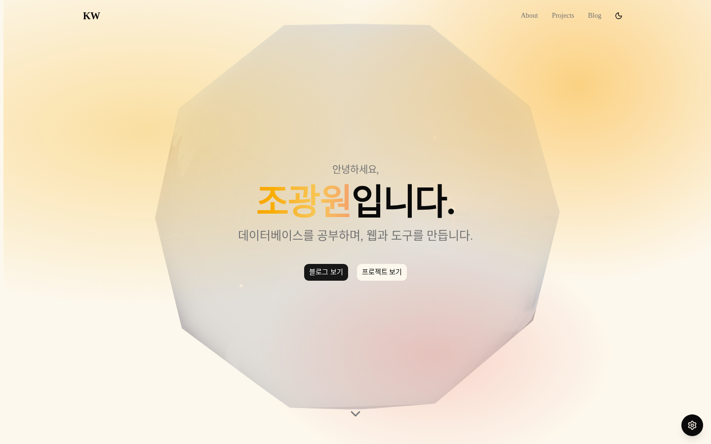
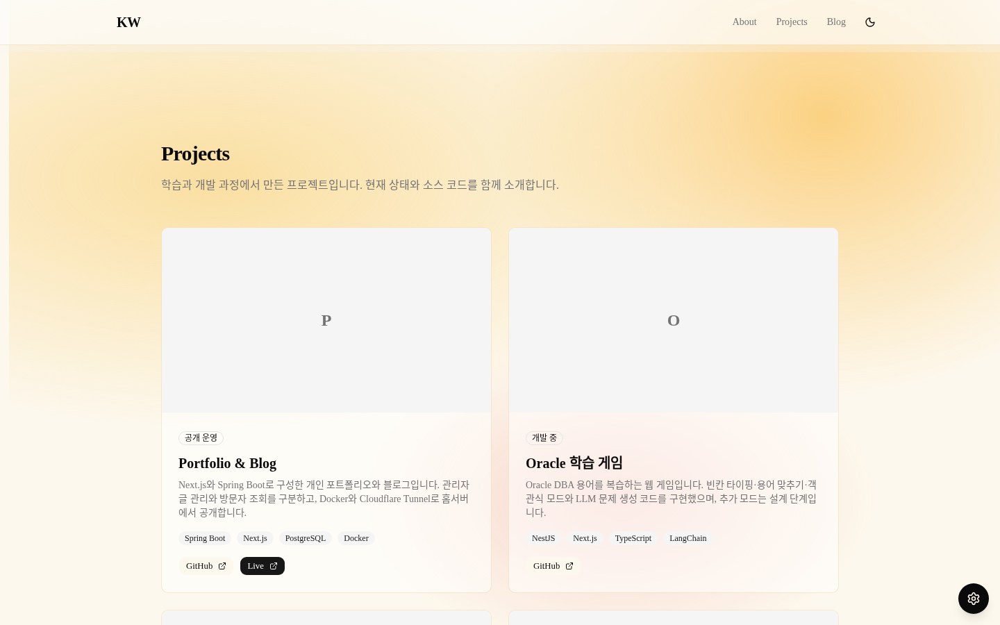

# 공개 사이트 화면·채용 포트폴리오 검토

검토일: 2026-09-13. 대상: https://gwangwon.dev 현재 공개본.
사용자는 디자인·기능 개선 논의 중 현재 화면의 품질과 채용 포트폴리오 관점의 문제 탐색을 우선 요청했다.
이 문서는 관찰 결과와 개선 제안이며 리디자인 최종 명세나 채용 결과 예측이 아니다.

## 확인 방법과 범위

- 실제 Chromium, PC 1440×900 라이트/다크, 모바일 390×844 라이트에서 홈 확인.
- 블로그/Office도 직접 접속. Office는 로딩 완료를 기다린 후 확인했고 영구 로딩 오류로 판단하지 않았다.
- 관찰한 세 홈 화면에서 가로 넘침 및 pageerror 없음. 전체 접근성·성능 검증을 마쳤다는 의미는 아니다.
- 새 카드/최근 글/메뉴 개선 코드는 로컬에 있으며 아직 공개하지 않았다. 아래 캡처는 그 이전 공개 화면이다.
- 측정 자료: [섹션 위치](assets/2026-09-13/observations.json), [글꼴 계산값](assets/2026-09-13/typography.json).

## 전체 판단

기본 열 정렬과 반응형 동작은 갖췄다. 다만 현재 화면은 미완성 이미지 영역과 글꼴 오류가 먼저 보이고,
큰 배경 장식과 긴 섹션 간격이 프로젝트의 내용을 읽는 흐름을 약하게 만든다.
채용 포트폴리오로 제출하려면 대표 작업을 선별하고 실제 결과·담당 역할·판단 근거가 빠르게 보이도록 편집할 필요가 있다.
이는 시각적·편집적 판단이다. 임의 점수를 객관적인 채용 기준처럼 부여하지 않는다.

## 우선 문제

| 우선순위 | 관찰 | 화면/채용 관점 영향 | 개선 방향 |
|---|---|---|---|
| 1 | html/body/h1/영문 제목의 계산된 font-family가 Times New Roman. --font-sans 값은 비어 있음 | 한글·영문·기술명이 서로 다른 인상. 컴포넌트를 모아둔 느낌과 낮은 마감 품질 | globals.css의 자기 참조 변수 수정. 한글·영문 폰트 및 크기·줄 간격 기준 통일 |
| 1 | About의 224×224 KW 박스, 프로젝트의 큰 P/O/학 등 이니셜 썸네일 | 실제 결과물 대신 임시 이미지 자리가 가장 크게 보임 | 실제 화면·분석 출력·구조도 등 증거 이미지 사용. 없으면 이미지 영역 자체를 줄이거나 제거 |
| 1 | 대표 프로젝트 시작이 PC 약 2,012px, 모바일 약 2,373px. 모바일 전체 약 7,099px | 첫 방문자가 작업 근거를 보기까지 여러 화면을 지나야 함 | 짧은 소개 다음에 대표 프로젝트 배치. 기술·긴 자기소개는 뒤로 |
| 1 | Hero의 강조 버튼은 글이 없는 블로그로 이동 | 가장 눈에 띄는 행동이 빈 결과로 끝남 | 대표 프로젝트를 첫 버튼으로. 블로그는 실제 글이 생길 때 보조 동선으로 강화 |
| 1 | Contact는 GitHub 링크 한 개. 이력서·명시적 연락 방법 없음 | 관심을 갖고도 지원자에게 연락하는 경로가 약함 | 사용자 승인 연락처/이력서만 추가. 도메인 등록 이메일을 임의 공개하지 않음 |
| 2 | PC Hero의 3D 다면체가 본문 뒤 대부분을 차지. 배경에는 노란·분홍 메쉬, 이름에도 그라데이션 | 장식이 이름·소개와 비슷하거나 더 큰 시각적 비중을 가짐 | 3D 크기·채도·배경 투명도를 줄이고 텍스트 주변은 안정된 바탕 사용 |
| 2 | 6개 프로젝트가 같은 크기·비중이며 핵심 설명은 hover에서만 노출 | 대표작을 고르기 어렵고 모바일·키보드에서 근거가 숨겨짐 | 대표 2개를 상세히, 나머지는 간결하게. 핵심 내용은 항상 표시 |
| 2 | 프로젝트에 일반 기능·기술 태그 위주 설명 | 무엇을 해결했고 본인이 어떤 판단을 했는지 알기 어려움 | 문제 → 담당 범위 → 선택·이유 → 확인한 결과 → 남은 한계 순서의 짧은 사례 작성 |
| 2 | 화면마다 우하단 테마 조정 버튼. 클릭하면 메쉬 채도·투명도·CSS 추출 도구가 공개됨 | 채용 방문 목적과 무관한 조작이 계속 시선을 끔. 미완성 편집 화면 인상 | 공개 화면은 라이트/다크 선택만 유지하고 개발용 조정 패널 제외 |
| 2 | Tech Stack 독립 영역 약 506px, About 576px/모바일 940px. 빈 Blog+Contact도 PC 약 970px | 전달 정보에 비해 페이지가 길고 각 구간의 시각적 리듬이 비슷함 | 기술은 대표 프로젝트에 연결. 빈 섹션·중복 설명 축소. 제목-내용 간격과 섹션 간격 구분 |
| 3 | 모바일 소개 문장이 단어 중간에서 줄바꿈. 영문 섹션명과 한글 본문, 작은 배지/버튼 반복 | 긴 문단과 미세한 요소가 혼재해 훑어읽기가 어려움 | 한글 줄바꿈·문단 길이 조정. 보조 라벨과 제목 언어 규칙 정리. 모바일 조작 영역 확인 |
| 3 | Office에 소개/프로젝트 버튼이 있지만 그 페이지에는 대상 섹션이 없음 | 메뉴를 눌러도 기대한 이동이 없음 | /#about, /#projects 실제 링크 및 고정 헤더 스크롤 여백 적용 |

글꼴의 직접 원인은 [globals.css](../../frontend/app/globals.css)의 `--font-sans: var(--font-sans)` 자기 참조다.
Geist 변수는 계산값에 존재하지만 본문의 폰트 변수에는 연결되지 않았다. 한글은 시스템 폴백으로 렌더링된다.

## 시각 증거

### 첫 화면: 큰 장식과 빈 블로그 CTA

### 프로젝트: 결과물이 없는 큰 썸네일

### 모바일: 정보량에 비해 큰 공간, 단어 중간 줄바꿈

[모바일 첫 화면](assets/2026-09-13/mobile-light-hero.png) · [모바일 소개](assets/2026-09-13/mobile-light-about.png)

### 부가 관찰

[다크 모드 첫 화면](assets/2026-09-13/desktop-dark-hero.png) · [빈 블로그](assets/2026-09-13/desktop-blog.png) · [공개 테마 조정 패널](assets/2026-09-13/desktop-theme-panel.png)

## 권장 화면 순서

1. 이름 + 현재 집중 분야 + 대표 프로젝트 이동. 데스크톱에서도 첫 화면 아래 다음 콘텐츠가 보이는 높이.
2. 대표 프로젝트 2개: 실제 결과물, 문제, 본인 역할, 판단 및 확인 근거. 직무에 따라 선정.
3. 나머지 프로젝트: 작은 카드/목록과 저장소 링크.
4. 기술과 경험: 프로젝트에서 사용한 기술과 확인된 교육·작업 이력.
5. 실제 글이 있을 때 최근 기록. 연락 경로와 이력서 링크.

DB/백엔드 지원을 우선한다면 Oracle 학습 게임과 Alert Log 분석을 먼저 검토할 수 있다.
개별 프로젝트에서 직접 담당한 범위와 검증 결과는 사용자 확인이 필요하다. 저장소 존재나 테스트 수를 개인 역량의 점수로 환산하지 않는다.
3D와 Pixel Office는 관심이 있는 방문자가 별도로 둘러볼 수 있는 실험 영역으로 활용할 수 있다.

## 이미 착수한 로컬 개선과 배포 상태

앞선 포괄적 개선 요청에 따라 아래를 구현했으나, 사용자가 화면 탐색을 우선 요청하여 배포를 진행하지 않았다.

- 최신 공개 글 3개 조회, 빈 결과와 오류 구분, 재시도.
- 프로젝트 카드의 이니셜 썸네일 제거, 핵심 내용 상시 표시.
- 메뉴의 홈 섹션 링크·Office 링크·모바일 펼침 상태·Escape 닫기·포커스 복귀.
- 관련 동작 테스트 6개 통과. 이 로컬 변경에 대한 전체 테스트/운영 빌드/시각 검증은 아직 수행하지 않음.

위 캡처는 검토 시점의 공개본이다. 이후 적용한 변경은 아래 후속 기록에서 구분한다.

## 후속 적용 1 — 글꼴·모바일 줄바꿈

사용자가 권장 순서대로 조금씩 수정하도록 요청해 첫 단계만 공개했다.

- sans 글꼴의 순환 참조를 제거하고 Pretendard Variable → Geist → 시스템 sans-serif 순서로 적용.
- 포트폴리오 main에 keep-all과 긴 문자열 줄바꿈을 적용. Hero 모바일 제목은 36px, 소개는 균형 잡힌 줄 배치를 사용.
- 실제 Chromium에서 PC 1440px 라이트/다크, 모바일 390px·320px 검증.
  CSS 계산값과 실제 렌더링 폰트가 Pretendard Variable임을 확인했고 가로 넘침·pageerror 없음.
- 공개 HTTPS에서도 글꼴·제목 크기·줄바꿈·API health 정상 확인.
- 카드·메뉴·최신 글의 앞선 로컬 개선은 이번 이미지에 포함하지 않았다.
- 다음 단계: KW/P/O 등 임시 이미지 영역과 프로젝트 카드 정리.

[변경 후 공개 모바일 화면](assets/2026-09-13/typography-step1/public-mobile.png) · [PC 글꼴](assets/2026-09-13/typography-step1/desktop-light-hero.png) · [모바일 본문](assets/2026-09-13/typography-step1/mobile-light-about.png) · [브라우저 검증값](assets/2026-09-13/typography-step1/metrics.json)

## 후속 적용 2 — 임시 이미지 제거·프로젝트 카드 공개

- About의 KW 이미지 자리를 없애고 이름과 기존 소개를 텍스트로 배치했다.
- 프로젝트 6개의 큰 이니셜 썸네일을 제거했다. 상태·설명·핵심 구현·기술·저장소 링크를 항상 표시한다.
- 하단 링크는 높이 44px 이상으로 조정했다. PC에서는 같은 행의 카드 높이가 맞는다.
- Chromium 미리보기 및 공개 HTTPS: 1440px 라이트/다크, 390px·320px 모바일에서 가로 넘침과 pageerror 없음.
  카드 6개, 링크 7개, 핵심 구현 목록 상시 노출, 링크 높이를 확인했다.
- 운영 빌드·TypeScript 통과, ESLint 오류 0·기존 경고 6. CSS 구조를 반복하는 새 단위 테스트 대신 실제 브라우저 검증을 사용했다.
- 메뉴·최근 글·공통 스크롤 여백 변경은 아직 미배포다. 이번 이미지는 AboutSection과 ProjectCard만 이전 공개본에서 교체했다.

| 섹션 높이 | 이전 공개본 | 이번 공개본 |
|---|---:|---:|
| About, PC 1440px | 576px | 444px |
| About, 모바일 390px | 940px | 648px |
| Projects, PC 1440px | 2011px | 1873px |
| Projects, 모바일 390px | 3290px | 3398px |
| Projects, 모바일 320px | 3289px | 3711px |

모바일 카드의 핵심 내용을 펼치고 버튼을 키웠으므로 프로젝트 섹션은 더 길어졌다.
모든 화면에서 스크롤이 줄었다고 평가하지 않는다. 다음 단계에서는 대표작과 나머지 작업의 비중을 구분해 탐색 길이를 줄인다.
배경·첫 화면의 장식, 개발용 테마 패널 등 기존 검토 항목은 후속 개선 대상이다.

[공개 PC 카드](assets/2026-09-13/cards-step2/public-desktop-projects-viewport.png) · [공개 모바일 카드](assets/2026-09-13/cards-step2/public-mobile-projects-viewport.png) · [공개 모바일 소개](assets/2026-09-13/cards-step2/public-mobile-about-viewport.png) · [다크 카드](assets/2026-09-13/cards-step2/public-dark-projects-viewport.png) · [공개 브라우저 검증값](assets/2026-09-13/cards-step2/public-metrics.json)

## 후속 적용 3 — 첫 화면·대표 프로젝트 공개

- 전체 화면 Hero·3D Canvas·이름 그라데이션을 제거하고 이름·관심 분야·프로젝트 이동을 배치했다.
- 홈은 단색 배경, Hero 다음에 Projects를 배치한다. 대표 2개와 나머지 4개 목록을 구분했다.
- 대표작은 공개 운영 중인 Portfolio & Blog와 Oracle 학습 게임이다. 개인 숙련도 순위나 직무 적합도 평가를 뜻하지 않는다.
- Projects/About 메뉴를 실제 홈 앵커로 연결하고 Office 링크, 모바일 Escape 닫기·이동 후 닫기, 스크롤 여백을 공개했다.
- 공통 테마 편집 패널은 개발 모드에서만 표시한다.
- PC 1440px 라이트/다크 및 390px·320px 모바일(320px 동작 줄이기 포함), 실제 HTTPS에서 넘침·pageerror 없음.
- 프로젝트 섹션은 PC 상단 475.5px, 모바일 442.5px에서 시작한다. 첫 대표 카드 제목은 각각 769.5px, 708.5px에 표시된다.
- 현재 홈 전체 높이는 PC 4334px, 모바일 390px 5466px, 320px 5974px. 작은 화면에서는 여전히 여러 번의 스크롤이 필요하다.
- 프런트엔드 131 tests·운영 빌드·TypeScript 통과. lint 오류 0·기존 경고 6.
- 블로그의 후속 방향은 [별도 검토](blog-review-2026-09-13.md)에 기록했다. 최근 글 기능은 아직 미배포다.

[공개 PC 첫 화면](assets/2026-09-13/priority-step3/public-desktop-hero.png) · [모바일 첫 화면](assets/2026-09-13/priority-step3/public-mobile-hero.png) · [다크 첫 화면](assets/2026-09-13/priority-step3/public-dark-hero.png) · [검증값](assets/2026-09-13/priority-step3/public-metrics.json)
